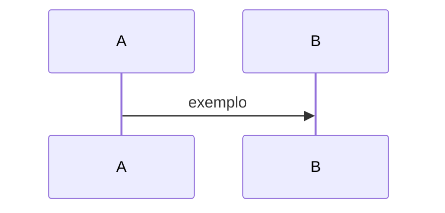

# Documentação AegisPass (fonte única)

> 💡 **Conceito — SSOT (*Single Source of Truth*):** o texto vive aqui em Markdown.
> A app em **Definições → Documentação** lê JSON gerado — nunca dupliques conteúdo
> no frontend.

## Pastas

| Pasta | Audiência | Na app |
|---|---|---|
| [`concepts/`](concepts/) | Todos | Glossário, cartões expansíveis |
| [`product/`](product/) | Utilizador | Funcionalidades |
| [`developer/`](developer/) | Programador | Front, back, API |
| [`competitive/`](competitive/) | PM / dev | Roadmap e concorrência |
| [`roadmap/`](roadmap/) | Equipa interna | Planeamento (journeys também na app) |

## Convenções nos `.md`

```markdown
---
title: Título
slug: meu-slug
audience: [user, developer]
level: 1
summary: Uma linha
related: [glossary, vault]
---

:::summary
Texto sempre visível no topo.
:::

:::concept{id="nonce" title="Nonce" level=2}
Explicação didática — aparece como dropdown na app.
:::

:::level{level=2 title="Aprofundar"}
Conteúdo intermédio — secção colapsável.
:::



Ou bloco dedicado com título:

:::flow{id=meu-fluxo title="Fluxo de login" type=sequence}
```mermaid
sequenceDiagram
    ...
```
:::
```

**Níveis:** `1` Essencial · `2` Intermédio · `3` Técnico

**Fluxos:** blocos `mermaid` renderizam como diagrama + player passo-a-passo (DOC-008/009).

## Regenerar para a app

```bash
npm run docs:build    # na raiz do monorepo
# ou
make docs-build
```

O output vai para `frontend/src/lib/docs/generated/`.
