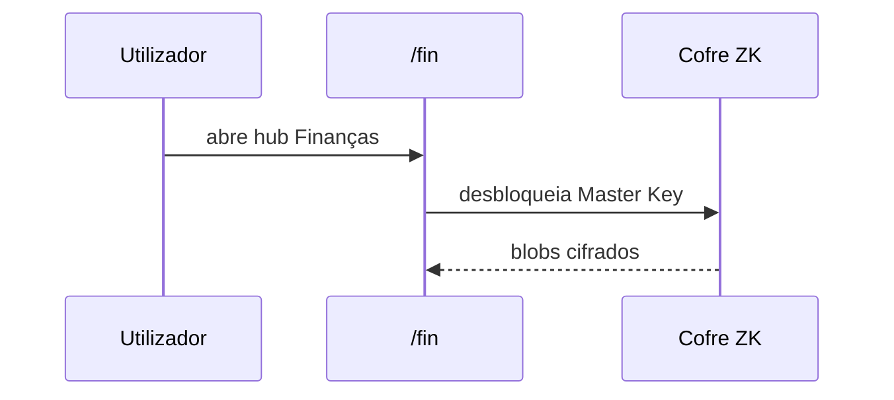
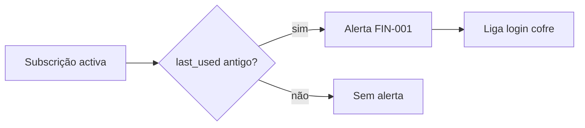
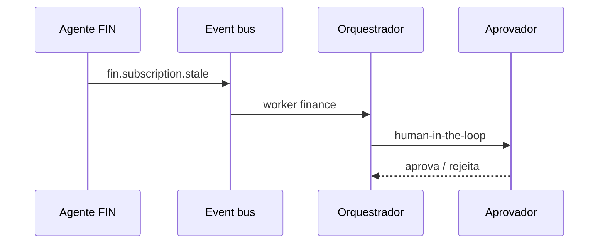

:::summary
O módulo **Finanças** cobre custos SaaS, classificação fiscal, faturação ERP,
comissões e reconciliação bancária — com dados sensíveis sempre cifrados no cliente.
:::

:::concept{id="saas-subscription" title="Subscrição SaaS" level=1}
Registo de um serviço pago: nome, custo, moeda, ciclo, categoria, código fiscal
opcional e data de último uso. Pode ligar-se a um login do cofre pelo ID do item.
:::

:::concept{id="fiscal-code" title="Código fiscal (FIN-005)" level=2}
Classificação IRC (ex.: dedutível 100%, investimento) guardada **dentro do blob
cifrado** da subscrição. Totais dedutíveis calculam-se só no browser.
:::

:::level{level=1 title="Rotas na app"}

| Rota | Função |
|---|---|
| `/fin` | Subscrições, alertas licenças sem uso, feed agente |
| `/fin/fiscal` | Resumo dedutível mensal + classificação |
| `/fin/banking` | Open Banking (mock em dev) + reconciliação |
| `/fin/invoices` | Pro-forma, faturas, recibos (FIN-006) |
| `/fin/commissions` | Comissões sobre faturas pagas (FIN-007) |
:::

:::level{level=2 title="Alertas de licença sem uso"}

Regra no cliente: subscrição activa com `last_used_at` antigo ou em falta.
Cruza com logins do cofre para sugerir corte de custos.
:::

:::level{level=2 title="Agente financeiro"}

Reporta licenças stale e movimentos bancários ao orquestrador. Acções sensíveis
passam por **Human-in-the-loop** no feed de eventos.
:::

:::level{level=3 title="Técnico"}
Frontend: `frontend/src/lib/fin/`. Backend: blobs em `saas_subscriptions`, APIs
`/api/fin/*`, Open Banking em `internal/openbanking/`. Epic:
`docs/roadmap/03-epics/epic-fintech.md`.
:::
