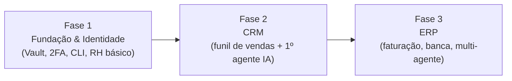

# 00 — Visão Geral

## 1. O Produto

**AegisPass** é uma plataforma unificada de **Gestão de Identidade, Acesso
Efémero, Controlo Financeiro de SaaS e Recursos Humanos**, desenhada para
empresas que operam em modelo **BYOD**.

> 💡 **Conceito — BYOD (*Bring Your Own Device*):** os funcionários usam os seus
> próprios computadores/telemóveis para trabalhar. É barato para a empresa, mas
> cria um problema enorme de segurança: como garantir que dados sensíveis da
> empresa não ficam expostos num aparelho que a empresa não controla?

O AegisPass é a **ponte segura** que isola a vida profissional da pessoal no
mesmo aparelho, garantindo isolamento absoluto dos dados corporativos.

## 2. O Problema

| Dor da empresa | Como o AegisPass resolve |
|---|---|
| Funcionário usa PC pessoal | Browser isolado dentro da app; passwords ocultas |
| Risco de roubo/fuga de dados | Geofencing + remote wipe de dados corporativos |
| Descontrolo de custos SaaS | Gestão de subscrições e cartões virtuais |
| Dificuldade em gerir acessos | Sessões de acesso baseadas em turnos/horário |
| Conformidade RGPD | Cifragem campo-a-campo + logs imutáveis + direito ao esquecimento |

## 3. Proposta de Valor (porque é que uma empresa compra)

1. **Custo Zero de Hardware:** a empresa não compra portáteis; paga uma
   subscrição por "*Assento Protegido*".
2. **Conformidade RGPD por desenho:** o servidor nunca vê dados em texto limpo.
3. **Controlo BYOD real:** se um funcionário sai, os dados corporativos saem do
   aparelho dele sem tocar nas fotos/apps pessoais.
4. **Soberania:** a empresa mantém controlo de ponta a ponta dos seus segredos.

> 💡 **Conceito — Zero-Knowledge:** o servidor guarda apenas dados cifrados e
> nunca conhece a chave que os decifra. Mesmo que o servidor seja invadido (ou
> intimado por um tribunal), não há nada legível para entregar. A cifragem e
> decifragem acontecem **no dispositivo do utilizador** (*client-side*).

## 4. Pilares Técnicos

- **Zero-Knowledge / E2EE** — cifragem ponta-a-ponta, chaves derivadas no cliente.
- **Zero-Trust** — nada é acessível por omissão; cada pedido é validado (turno,
  geofencing, VPN).
- **Multi-tenant isolado** — cada empresa numa sandbox; dados nunca se cruzam.
- **Performance** — Go (backend concorrente) + Svelte (frontend sem overhead).

## 5. Glossário (termos que vais ver por todo o roadmap)

| Termo | Significado curto |
|---|---|
| **Tenant** | Uma empresa-cliente isolada dentro do sistema |
| **Vault / Cofre** | Contentor cifrado de credenciais e segredos |
| **Master Password** | A palavra-passe de onde se deriva a chave de cifragem |
| **Argon2id** | Função de derivação de chave resistente a ataques de força bruta |
| **AES-GCM-256** | Algoritmo de cifragem simétrica autenticada |
| **Nonce** | Número usado uma só vez por cifragem (nunca repetir!) |
| **TOTP** | Código 2FA temporário baseado em tempo (RFC 6238) |
| **Geofencing** | Regras baseadas na localização geográfica do dispositivo |
| **Remote Wipe** | Apagar remotamente dados corporativos do dispositivo |
| **Ephemeral access** | Acesso temporário que expira (ex: fim do turno) |
| **Agent / Agente** | Componente de IA autónomo que executa tarefas do ERP/CRM |

## 6. Visão a 3 fases (resumo — detalhe em `02-phases/`)

## 7. Propriedade intelectual

O AegisPass é construído **de raiz** sobre uma stack 100% open-source. Quando nos
inspiramos em padrões conhecidos da indústria (ex: sistemas multi-agente),
reimplementamos tudo de origem e **nunca** incorporamos código proprietário de
terceiros — ver
[`01-architecture/agents-architecture.md`](01-architecture/agents-architecture.md).
