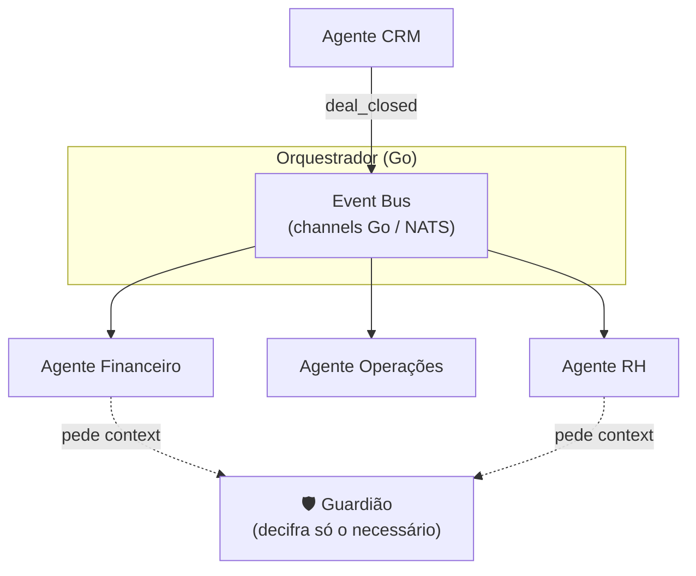

# Arquitetura — Sistema Multi-Agente (ERP/CRM)

Esta é a visão da **Fase 3**: substituir os formulários rígidos de um ERP por
**agentes de IA** que cooperam e executam tarefas autonomamente.

## ⚖️ Nota de propriedade intelectual

Inspiramo-nos em **padrões conhecidos da indústria** para sistemas agentic
(tool systems, orquestração multi-agente, permissões). 

> ⚠️ **Decisão:** estudamos padrões publicamente conhecidos **apenas como
> referência conceptual** e **reimplementamos tudo de raiz em Go**. Nunca
> copiamos código proprietário de terceiros — isso criaria risco legal e
> contradiria a promessa de confiança/conformidade do produto.

### Padrões que reimplementamos de raiz

| Padrão | Descrição | Equivalente AegisPass (Go) |
|---|---|---|
| **Tool System** | Schema + permissão + execução por ferramenta | Interface `Tool` em Go com validação |
| **Coordinator / Swarm** | Orquestração de múltiplos agentes | Orquestrador de agentes via eventos |
| **Permission System** | Controlo de acesso por chamada | "Guardião" Go: nenhum agente vê a Master Key |
| **Integrações externas** | Conectores padronizados | Conectores a Google, Open Banking |
| **Query/streaming loop** | Ciclo de tool-calling com o modelo | Loop de tool-calling com LLM |

## Arquitetura orientada a eventos (EDA)

> 💡 **Conceito — Event-Driven Architecture:** em vez de um componente chamar
> outro diretamente, ele **publica um evento** ("deal_closed") e quem estiver
> interessado reage. Isto desacopla os agentes e torna o sistema extensível.



## O "Guardião" e a segurança com LLMs

> ⚠️ **Segurança:** os agentes (alimentados por LLMs, idealmente modelos
> *open-source* locais a correr isolados) **nunca** acedem à Master Key. A API Go
> atua como Guardião: decifra **apenas o pedaço** de informação necessário para
> a tarefa, entrega ao agente, e volta a cifrar o output.

```go
// O Guardião expõe contexto MÍNIMO ao agente. Em vez de passar a ficha inteira
// do cliente, devolve só os campos que a tarefa pede (princípio do menor
// privilégio). `ctx` (context.Context) é o padrão de Go para passar prazos,
// cancelamento e valores com escopo de request entre funções.
func (g *Guardian) ContextoParaAgente(ctx context.Context, req AgentRequest) (Scoped, error) {
    if !g.policy.Permite(req.AgentID, req.Campos) {
        return Scoped{}, ErrAcessoNegado // negar por omissão (zero-trust)
    }
    return g.decifrarApenas(ctx, req.Campos)
}
```

## Ecossistema de agentes (o "staff" de IA)

| Módulo | Agente | Função |
|---|---|---|
| CRM | Prospeção & Enriquecimento | Analisa leads/e-mails, preenche ficha do cliente |
| CRM | Negociação (Sales Copilot) | Sugere margens, redige propostas |
| Financeiro | Reconciliação Bancária | Concilia pagamentos via Open Banking |
| Financeiro | Otimização Fiscal | Categoriza despesas SaaS para dedução |
| RH | Recrutamento | Triagem às cegas (oculta género/etnia) + agenda |
| RH | Onboarding | Cria credenciais, e-mail, contrato |
| Operações | Compras & Inventário | Prevê stock, gera ordens de compra |

Detalhe e tasks em [`../03-epics/epic-agents.md`](../03-epics/epic-agents.md).
