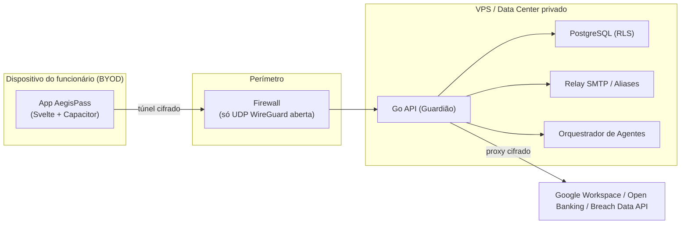
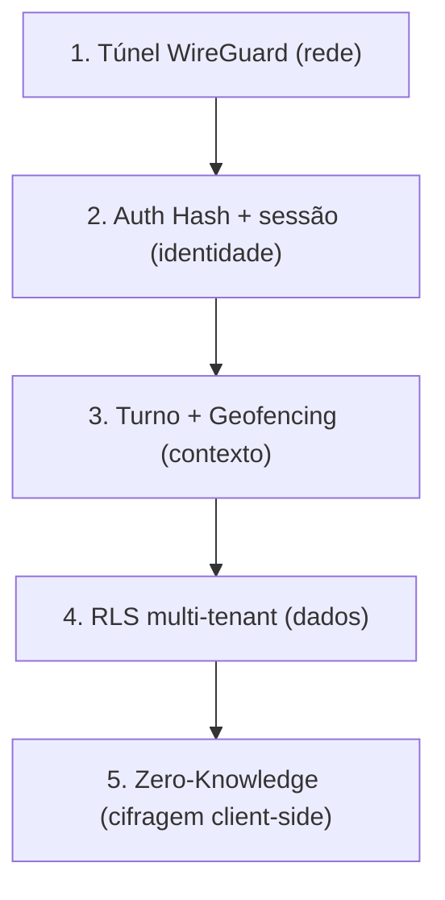
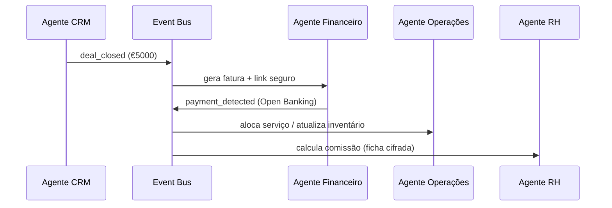

# Diagramas — Visão de Sistema

Diagramas em [Mermaid](https://mermaid.js.org/) (renderizam no GitHub e no Cursor).

## Topologia geral (BYOD → VPN → VPS)

## Camadas de defesa (Zero-Trust)

## Fluxo de evento no ERP (Fase 3)

> Mais diagramas específicos vivem junto do tema relevante (ex: o fluxo
> Zero-Knowledge está em [`../zero-knowledge.md`](../zero-knowledge.md)).
