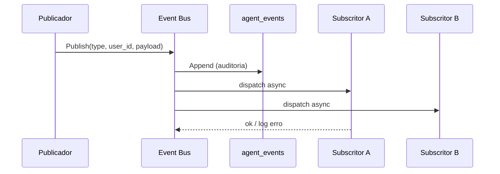
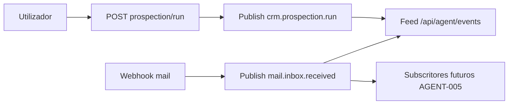
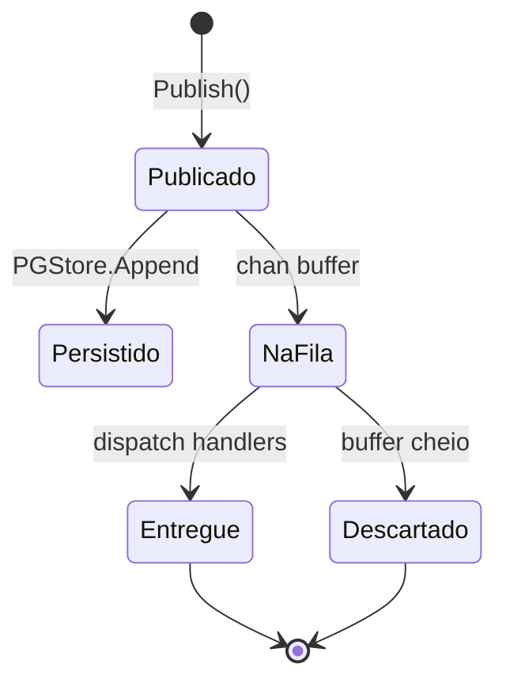
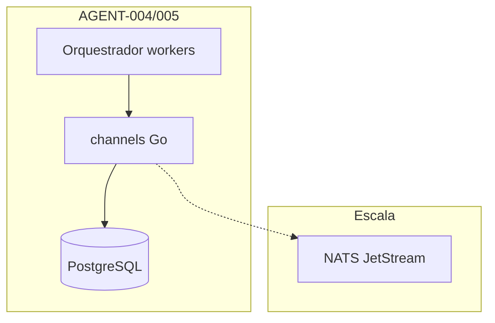

# Arquitectura — Event Bus de agentes (AGENT-004)

> 💡 **Conceito — Event Bus:** canal onde componentes **publicam** factos
> (`mail.inbox.received`) e outros **subscrevem** reacções, sem acoplamento
> directo. Em Go começamos com `chan Event`; NATS para cluster multi-nó.

## Tipos de evento (v1)

| Tipo | Origem | Payload (metadados) |
|---|---|---|
| `mail.inbox.received` | Webhook Mailpit | `inbox_id`, `alias`, `relayed` |
| `crm.prospection.run` | POST prospection | `draft_count` |
| `agent.tool.executed` | POST tool/run | `tool`, `agent_id`, `success` |
| `orchestrator.action.suggested` | Worker orquestrador | `action`, `auto_run: false` |
| `orchestrator.action.approved` | POST approve | `suggestion_id`, `action` |
| `orchestrator.action.rejected` | POST reject | `suggestion_id`, `action` |

> ⚠️ **Segurança:** payloads sem PII de leads — blobs CRM nunca no bus.

## Fluxo publish/subscribe (sequence)

## Pipeline mail → CRM (flowchart)

## Ciclo de vida de um evento (stateDiagram)

## Orquestrador (AGENT-005)

Ver [`orchestrator.md`](orchestrator.md) — workers subscrevem o bus e publicam sugestões.

## Evolução (escala)

Ver também [`agents-architecture.md`](agents-architecture.md) e
[`../04-user-journeys/journey-agent-event-feed.md`](../04-user-journeys/journey-agent-event-feed.md).
