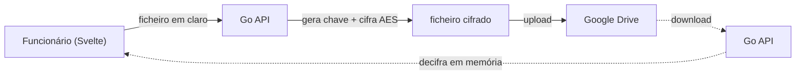

# Arquitetura — Layer de Controlo sobre o Google Workspace

A "funcionalidade de ouro" para empresas: continuar a usar Gmail/Drive/Docs/
Sheets (que a equipa adora) **sem expor dados sensíveis** à Google.

> 💡 **Conceito — Proxy de ofuscação:** a app Go intercepta os dados *antes* de
> saírem para a Google. A Google passa a ser só "os tubos"/armazenamento; a
> inteligência e a cifragem são do AegisPass.

## A. Drive & Docs — Cifragem Zero-Knowledge



Resultado: na Drive da empresa o ficheiro é ilegível (ex: `dGhpcyBpcy...`). Se a
Google for atacada, não há dados expostos.

## B. Sheets — Mascaramento Dinâmico (*Data Masking*)

> ⚠️ **Segurança:** dados sensíveis (IBAN, NIF, salários) são substituídos por
> *tokens* antes de irem para a Sheet. A tabela token→valor fica no PostgreSQL
> cifrado. Quem vê a Sheet na Google vê `TOKEN_NIF_A91`; quem vê via AegisPass vê
> o valor real reinjetado em tempo real.

```go
// Exemplo didático: detetar e tokenizar um NIF português (9 dígitos) com regex.
// `regexp.MustCompile` compila o padrão uma vez (idealmente como var global),
// porque compilar é caro e não queremos repeti-lo a cada chamada.
var nifPattern = regexp.MustCompile(`\b\d{9}\b`)

func mascarar(texto string, cofre TokenVault) string {
    // ReplaceAllStringFunc chama a nossa função para CADA correspondência,
    // permitindo gerar um token único e guardar o mapeamento.
    return nifPattern.ReplaceAllStringFunc(texto, func(nif string) string {
        return cofre.GuardarEObterToken("NIF", nif)
    })
}
```

## C. Gmail — Relay com Aliases + PGP

O AegisPass atua como relay SMTP: o e-mail é redigido no Svelte, passa pela API
Go que mascara o remetente com um **alias** e pode anexar chaves PGP. O Gmail é
só transporte; identidades reais ficam protegidas.

Ver [`../03-epics/epic-aliases-email.md`](../03-epics/epic-aliases-email.md).

## Integração técnica (OAuth2 + Service Accounts)

> 💡 **Conceito — OAuth2:** protocolo que permite à empresa autorizar o AegisPass
> a agir em nome dela na Google **sem** lhe dar a password. Em vez disso, recebe
> *tokens* com permissões limitadas e revogáveis.

> 💡 **Conceito — Service Account:** uma "conta de robô" da Google com permissões
> granulares de administrador. A API Go usa-a nos bastidores, em vez de cada
> funcionário ter acesso direto.

> ⚠️ **Segurança / BYOD:** mesmo com tokens guardados, o ficheiro na Drive é
> inútil fora do turno/VPN — porque o AegisPass revoga temporariamente o acesso à
> **chave de desencriptação**. O conteúdo permanece cifrado.

## Vantagem competitiva

- **Custo de armazenamento ~zero** para o AegisPass (usa o espaço que a empresa
  já paga à Google).
- **Conformidade RGPD instantânea:** "use o Google que já tem, mas a Google deixa
  de ver os dados reais".

## Estado de implementação (2026)

| Componente | Dev local | Produção | Código / rota |
|---|---|---|---|
| GOOGLE-001 OAuth/SA | 🟢 `mock` provider | 🟡 guia VPS | `internal/googleworkspace/`, `/work/google` |
| GOOGLE-002 Drive ZK | 🟢 API blobs + local | 🟡 upload Google API | `/work/google-dev`, `driveService.ts`, `POST /api/work/google/drive/files` |
| GOOGLE-003 Sheets mask | 🟢 stub | ⚪ API Sheets | `masking.ts` |
| GOOGLE-004 Gmail relay | ⚪ | ⚪ | depende MAIL-004 |

Journeys: [`journey-google-dev-stub.md`](../04-user-journeys/journey-google-dev-stub.md) ·
Produção: [`10-production/google-001-oauth.md`](../10-production/google-001-oauth.md)
