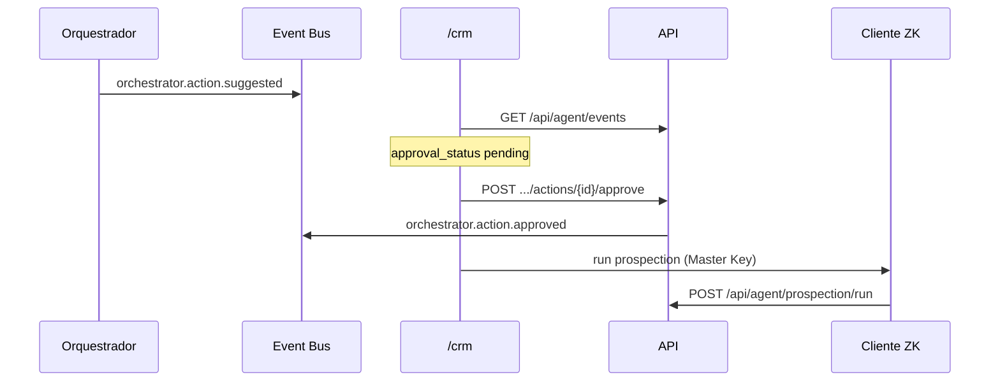
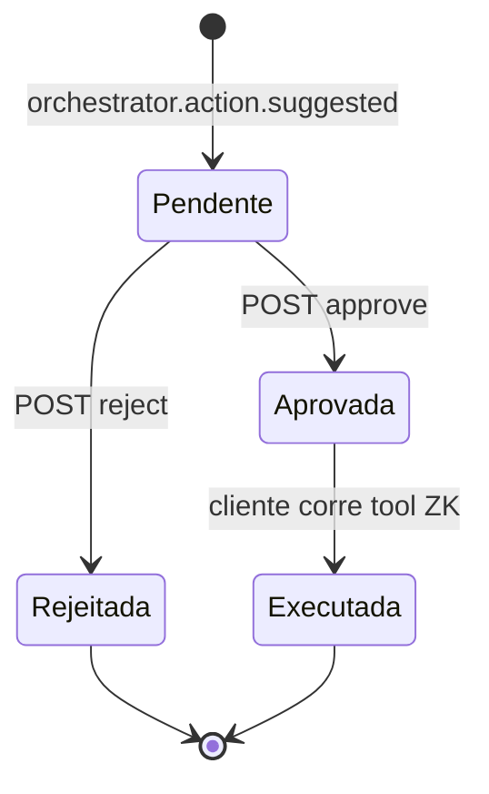

# Arquitectura — Human-in-the-loop (AGENT-009)

Garante que acções sensíveis (prospeção CRM, futuras FIN/RH) só avançam após
**aprovação explícita** do utilizador — o servidor regista a decisão, não executa
tools que exijam Master Key.

> 💡 **Conceito — Human-in-the-loop:** o orquestrador *sugere*; o humano *decide*.
> Evita automação cega em contexto Zero-Knowledge.

> ⚠️ **Segurança:** `POST approve` **não** corre prospeção no servidor — o cliente
> chama `POST /api/agent/prospection/run` depois do unlock, mantendo cifragem local.

## Tipos de evento

| Tipo | Quem publica | Significado |
|---|---|---|
| `orchestrator.action.suggested` | Worker orquestrador | Acção proposta (`run_prospection`, …) |
| `orchestrator.action.approved` | API após clique Aprovar | Decisão humana positiva |
| `orchestrator.action.rejected` | API após clique Rejeitar | Decisão humana negativa |

## Fluxo aprovação (sequence)



## Estados da sugestão (stateDiagram)



## API

```
POST /api/agent/orchestrator/actions/{id}/approve
POST /api/agent/orchestrator/actions/{id}/reject
GET  /api/agent/events  → approval_status em sugestões
```

Evolução: fila de aprovações FIN/RH, notificações push, timeout de sugestões.
