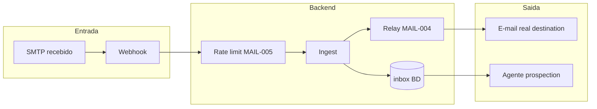
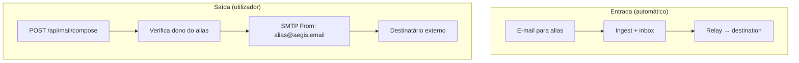
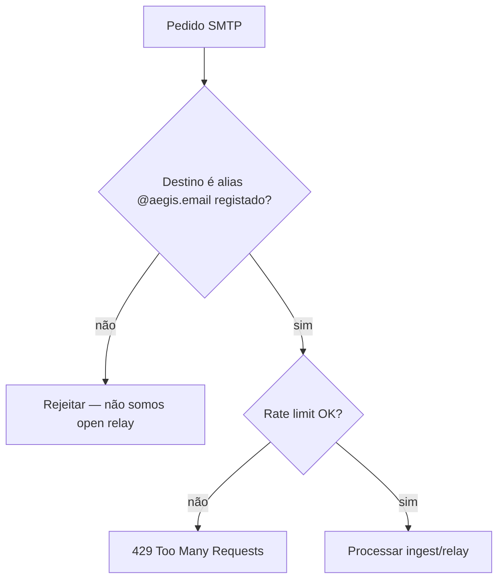

# Arquitectura — Pipeline de e-mail (MAIL)

Visão técnica do percurso SMTP → inbox → relay → CRM, com vários tipos de
diagrama para aprendizagem.

## Componentes

| Componente | Papel |
|---|---|
| **Mailpit** (dev) / **Postfix** (prod) | Recebe SMTP na porta 25/1025 |
| **Webhook** | Notifica o backend (`POST /api/mail/webhook/mailpit`) |
| **IngestService** | Resolve alias, grava inbox, dispara relay |
| **RelayService** | SMTP de saída para `destination` do alias |
| **InboxRepo** | `mail_inbox_messages` por `owner_id` |
| **Prospection** (AGENT-003) | inbox → rascunhos → CRM cifrado |

## Pipeline completo (flowchart)

## Relay vs compose (MAIL-004)

## Anti open-relay (MAIL-005)

> ⚠️ **Segurança:** só aceitamos entrega para aliases que existem na BD do
> tenant. Relay de saída exige sessão autenticada + propriedade do alias.

## Ligação ao epic

Ver [`../03-epics/epic-aliases-email.md`](../03-epics/epic-aliases-email.md) e
journeys em [`../04-user-journeys/`](../04-user-journeys/).
