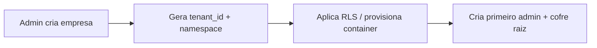

# Arquitetura — Multi-Tenancy (Isolamento por Empresa)

> 💡 **Conceito — Tenant:** cada empresa-cliente é um "tenant". Multi-tenancy é
> servir vários tenants na mesma infraestrutura **sem que os dados de um se
> cruzem com os de outro**. O desafio é o isolamento.

## Modelos possíveis (do mais barato ao mais isolado)

| Modelo | Isolamento | Custo | Quando usar |
|---|---|---|---|
| **Shared DB, shared schema** (coluna `tenant_id`) | Lógico | 💲 | MVP, muitos tenants pequenos |
| **Shared DB, schema por tenant** | Médio | 💲💲 | Tenants médios |
| **DB por tenant / container por tenant** | Forte | 💲💲💲 | Clientes enterprise sensíveis |

## Decisão do AegisPass

**Abordagem híbrida e faseada:**

- **Fase 1 (MVP):** *shared DB* com `tenant_id` em todas as tabelas + **Row-Level
  Security (RLS)** do PostgreSQL como rede de segurança.
- **Enterprise:** tenant dedicado em **container Docker isolado** (memória/disco
  separados), tal como descrito na visão original.

> ⚠️ **Segurança:** a defesa principal contra "vazar dados de outro tenant" não
> deve depender só de o programador lembrar-se de filtrar por `tenant_id`. Por
> isso ativamos **RLS** — o próprio PostgreSQL recusa devolver linhas de outro
> tenant, mesmo que um `WHERE` seja esquecido.

## Row-Level Security (exemplo)

```sql
-- Ativa RLS na tabela. A partir daqui, NENHUMA linha é visível sem uma política
-- que a autorize explicitamente.
ALTER TABLE vault_items ENABLE ROW LEVEL SECURITY;

-- Política: só vês linhas cujo tenant_id == tenant da sessão atual.
-- `current_setting('app.tenant_id')` é uma variável que a API Go define no
-- início de cada transação, a partir do token de sessão validado.
CREATE POLICY tenant_isolation ON vault_items
    USING (tenant_id = current_setting('app.tenant_id')::uuid);
```

```go
// No início de cada request, a API Go "fixa" o tenant na sessão da BD.
// A partir daqui, qualquer query nesta transação só toca dados deste tenant.
_, err := tx.Exec(ctx, "SET LOCAL app.tenant_id = $1", tenantID)
```

## Isolamento de memória (chaves)

> ⚠️ **Segurança:** as chaves de cifragem de cada tenant nunca devem coexistir
> sem fronteira. Em containers dedicados, o isolamento é do SO. No modelo
> partilhado, as chaves só existem **no cliente** (Zero-Knowledge), portanto o
> servidor nunca tem chaves de dois tenants em memória ao mesmo tempo.

## Onboarding de um novo tenant

Resumo (detalhe em [`../04-user-journeys/journey-admin-onboarding.md`](../04-user-journeys/journey-admin-onboarding.md)):


