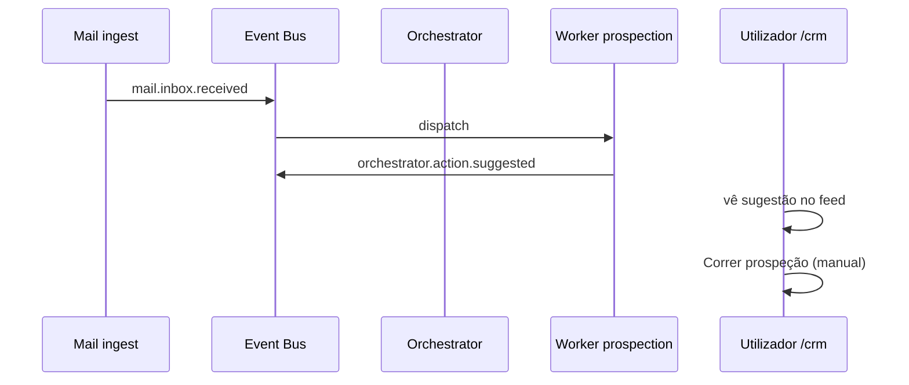
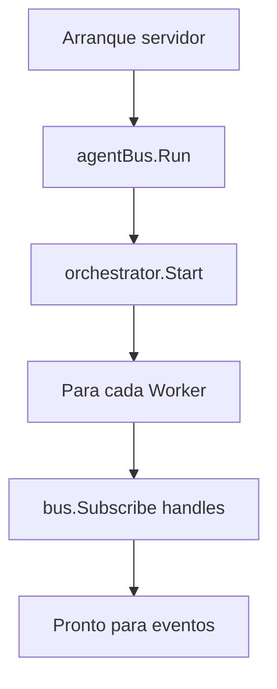
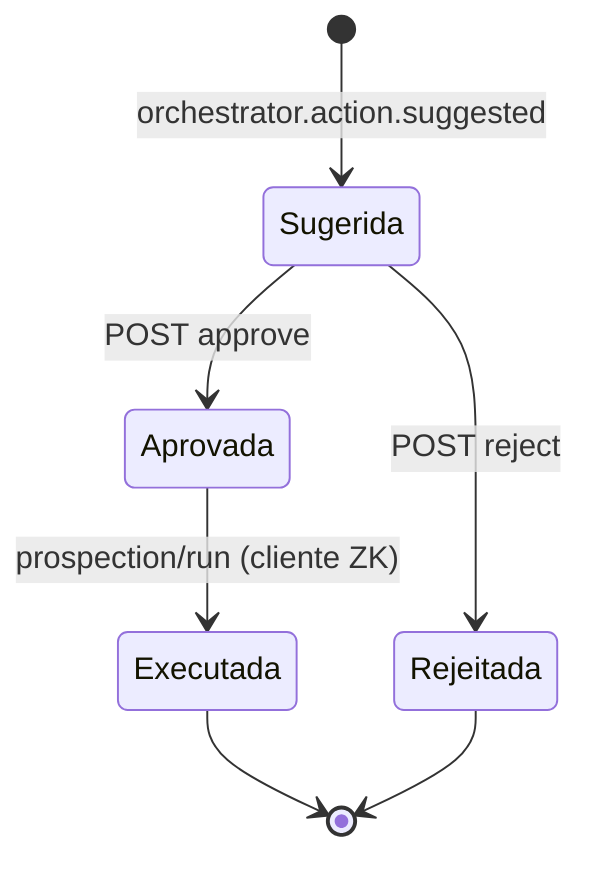

# Arquitectura — Orquestrador multi-agente (AGENT-005)

Coordena workers que reagem ao Event Bus sem acoplamento directo entre módulos.

> 💡 **Conceito — Orquestrador:** regista agentes (`Worker`), subscreve tipos de
> evento e delega `Handle`. Não substitui o Guardião — só encadeia reacções seguras.

## Workers v1

| Worker | Escuta | Publica |
|---|---|---|
| `prospection` | `mail.inbox.received` | `orchestrator.action.suggested` (`run_prospection`) |

> ⚠️ **Human-in-the-loop:** prospeção **não** corre automaticamente — o cliente
> precisa da Master Key. O worker só *sugere* a acção no feed.

## Fluxo mail → sugestão (sequence)



## Registo de workers (flowchart)



## Estados de uma sugestão (stateDiagram)

Ver também [`human-in-the-loop.md`](human-in-the-loop.md) (AGENT-009).



## API

```
GET /api/agent/orchestrator/status  → lista workers registados
GET /api/agent/events               → feed inclui sugestões + approval_status
POST /api/agent/orchestrator/actions/{id}/approve|reject  → AGENT-009
```

Evolução: mais workers (FIN, RH), filas persistentes, NATS (AGENT-004 roadmap).
