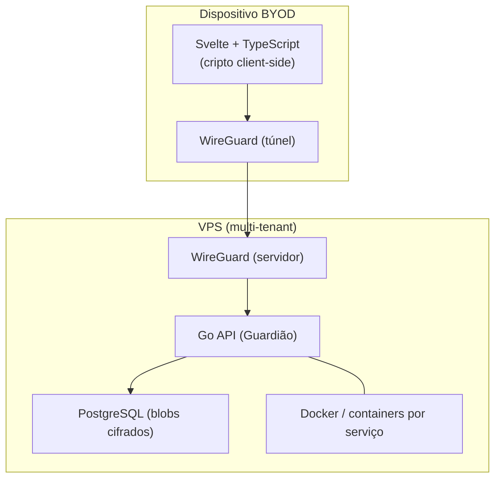

# Arquitetura — Stack Tecnológica

Toda a stack é **open-source / sem licenças proprietárias**, para garantir
soberania e custo previsível.

## Visão geral



## Camadas

| Camada | Tecnologia | Justificação técnica |
|---|---|---|
| Frontend | **Svelte + TypeScript** | Compila para JS quase nativo, sem overhead de runtime → rotinas de criptografia correm à velocidade máxima do motor V8 |
| Backend | **Go (Golang)** | Performance perto do C++, binários estáticos seguros, concorrência nativa (goroutines), excelente suporte de criptografia |
| Base de dados | **PostgreSQL** | Maduro, replicação, `JSONB`, e suporte a cifragem |
| Rede / túnel | **WireGuard** | VPN moderna, leve e rápida; só esta porta UDP fica exposta |
| Containers | **Docker + Docker Compose** | Isola cada serviço como "micro-VM" dentro da VPS |
| Empacotamento app | **Capacitor / Electron** | Encapsula o Svelte como app de telemóvel/desktop |

## Porque Go + Svelte (a "arma secreta")

> 💡 **Conceito — Goroutine:** é uma "thread" ultra-leve gerida pelo runtime de
> Go. Podem existir centenas de milhares em simultâneo com pouca memória, o que
> permite servir muitas empresas (multi-tenancy) numa única VPS modesta.

```go
// Exemplo didático: lançar trabalho concorrente em Go é tão simples como pôr
// a palavra-chave `go` antes da chamada de função. Isto NÃO bloqueia a linha
// seguinte — a função corre "ao lado", numa goroutine própria.
go enviarNotificacaoDeRevogacao(userID) // dispara e segue em frente

// Para comunicar entre goroutines com segurança usamos `channels` em vez de
// memória partilhada. Lema de Go: "não comuniques partilhando memória;
// partilha memória comunicando."
resultados := make(chan string)
```

## Princípios de exposição de rede

> ⚠️ **Segurança:** a API Go (`:8080`) e o PostgreSQL (`:5432`) **nunca** ficam
> expostos à internet pública. Só a porta **UDP do WireGuard** está aberta. Para
> aceder a qualquer serviço, o dispositivo tem primeiro de ligar o túnel VPN.

Ver detalhe em [`../07-non-functional/security.md`](../07-non-functional/security.md).
