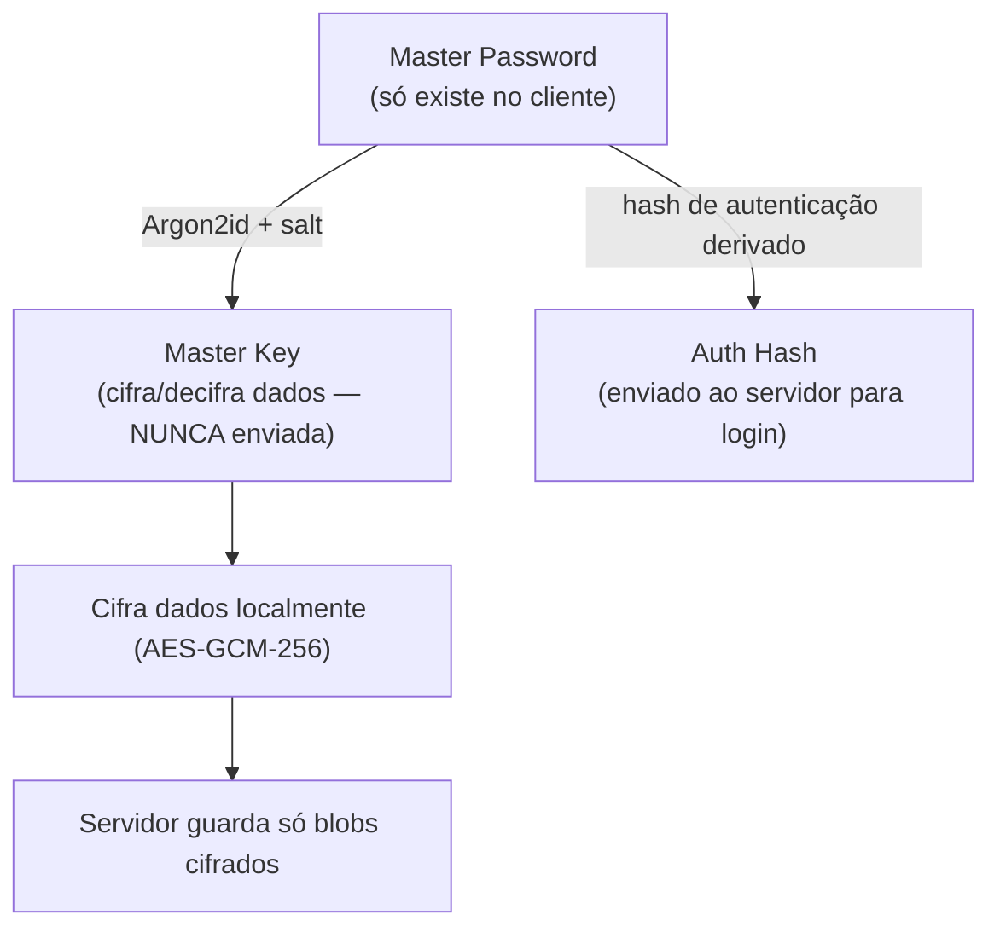
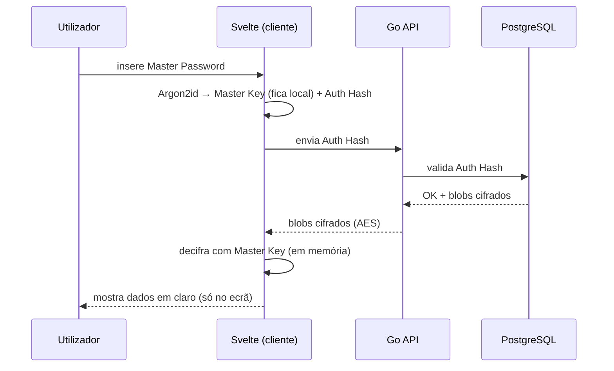

# Arquitetura — Núcleo Zero-Knowledge

Este é o coração do AegisPass e a base da conformidade RGPD por desenho
(*Privacy by Design*). **O servidor nunca conhece os dados em texto limpo.**

## 1. Derivação de chave (client-side)

A *Master Password* nunca sai do dispositivo. É transformada localmente em duas
coisas distintas:



> 💡 **Conceito — Argon2id:** função de *derivação de chave* (KDF) vencedora da
> Password Hashing Competition. É deliberadamente lenta e usa muita memória,
> tornando ataques de força bruta caríssimos. Tem dois "sabores": Argon2i
> (resistente a ataques de canal lateral) e Argon2d (resistente a GPU); o **id**
> combina ambos — a escolha recomendada.

> ⚠️ **Segurança:** a *Master Key* e a *Auth Hash* são **derivações diferentes**.
> Enviar para o servidor a chave que decifra os dados destruiria o modelo
> Zero-Knowledge. O servidor só recebe o `Auth Hash` (que não decifra nada).

## 2. Cifragem dos dados

Cada segredo/campo é cifrado com **AES-GCM-256** antes de sair do cliente.

```go
// AES-GCM (Galois/Counter Mode) dá-nos duas garantias ao mesmo tempo:
//  1. Confidencialidade (ninguém lê o conteúdo sem a chave)
//  2. Autenticidade/integridade (deteta se o ciphertext foi adulterado)
block, err := aes.NewCipher(key) // key tem de ter 32 bytes (256 bits)
if err != nil {
    return nil, err
}
gcm, err := cipher.NewGCM(block)
if err != nil {
    return nil, err
}

// O `nonce` é um número usado UMA só vez por chave. Geramo-lo a partir de uma
// fonte criptograficamente segura (crypto/rand), nunca de math/rand.
nonce := make([]byte, gcm.NonceSize())
if _, err := io.ReadFull(rand.Reader, nonce); err != nil {
    return nil, err
}

// Seal devolve nonce || ciphertext || authTag. Guardamos tudo junto.
ciphertext := gcm.Seal(nonce, nonce, plaintext, nil)
```

> ⚠️ **Segurança:** **nunca** reutilizar um `nonce` com a mesma chave em GCM —
> isso permite recuperar o *keystream* e quebra toda a confidencialidade. Por
> isso geramos sempre um nonce aleatório novo e guardamo-lo junto do ciphertext.

## 3. O que o servidor vê vs. o que existe

| Dado | No cliente | Na base de dados |
|---|---|---|
| Password de um site | `"correosecreto123"` | `9f3a...` (blob AES) |
| Salário (RH) | `2500.00 €` | `c81e...` (blob AES) |
| Título do evento | `"Consulta médica"` | `a7b2...` (blob AES) |
| Auth Hash | derivado, enviado | guardado (não decifra nada) |

## 4. Fluxo completo de autenticação + desencriptação

Ver o fluxograma detalhado em
[`../04-user-journeys/journey-employee-byod.md`](../04-user-journeys/journey-employee-byod.md).



## 5. Implicações de design

- Recuperação de conta é difícil **de propósito**: sem a Master Password, não há
  como decifrar. Mitigação: chave de recuperação + Acesso de Emergência
  (ver [`../03-epics/epic-vault.md`](../03-epics/epic-vault.md)).
- Operações como "pesquisa" têm de acontecer no cliente, ou usar índices cegos
  (*blind indexing*) — decisão a documentar nas tasks `VAULT`.
