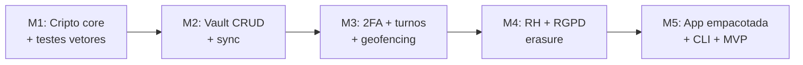

# Fase 1 — Fundação & Identidade

> **Objetivo:** ter um cofre Zero-Knowledge funcional e seguro, com identidade,
> 2FA e RH básico, capaz de atrair as primeiras PMEs com dores de RGPD.

Esta é a base sobre a qual tudo o resto assenta. Sem o núcleo de cifragem
sólido, nenhuma funcionalidade posterior é confiável.

## Âmbito (in scope)

- Núcleo Zero-Knowledge (Argon2id + AES-GCM-256) — ver [`epic-vault`](../03-epics/epic-vault.md)
- Vault: inícios de sessão, notas, cartões (ilimitados)
- Gerador de palavras-passe + alertas de passwords fracas/reutilizadas
- 2FA / TOTP integrado
- Acesso por turnos + Geofencing
- Remote wipe de emergência
- RH básico cifrado + direito ao esquecimento — ver [`epic-hr-rgpd`](../03-epics/epic-hr-rgpd.md)
- Multi-tenancy (shared DB + RLS)
- App Svelte (browser/desktop/mobile) + CLI em Go
- Infra: VPS + WireGuard + Docker + PostgreSQL

## Fora de âmbito (out of scope, fica para depois)

- CRM / funil de vendas (Fase 2)
- Agentes de IA (Fase 3)
- Layer de proxy Google (início na Fase 2)
- Open Banking / cartões virtuais reais (Fase 3)

## Épicos incluídos

| Epic | Prefixo | Ficheiro |
|---|---|---|
| The Vault | `VAULT` | [`epic-vault.md`](../03-epics/epic-vault.md) |
| RH & RGPD | `HR` | [`epic-hr-rgpd.md`](../03-epics/epic-hr-rgpd.md) |
| Aliases & E-mail (básico) | `MAIL` | [`epic-aliases-email.md`](../03-epics/epic-aliases-email.md) |

## Marcos (Milestones)

## Definition of Done (Fase 1)

- [ ] Cripto core passa em *test vectors* conhecidos (Argon2id, AES-GCM).
- [ ] Auditoria interna confirma: servidor nunca recebe Master Key em claro.
- [ ] Remote wipe testado em dispositivo real (mobile + desktop).
- [ ] RGPD: erasure gera certificado criptográfico e logs imutáveis íntegros.
- [ ] RLS impede acesso cross-tenant (teste automatizado).
- [ ] Cobertura de testes do core de segurança ≥ 90%.

## Riscos principais

| Risco | Mitigação |
|---|---|
| Erro na implementação de cripto | Usar bibliotecas padrão (`crypto/*` de Go, WebCrypto), nunca "inventar" cripto; *test vectors* |
| Perda de Master Password = perda de dados | Chave de recuperação + Acesso de Emergência |
| Fuga cross-tenant | RLS + testes automáticos dedicados |
