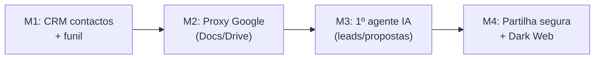

# Fase 2 — Pipeline de Vendas (Nascimento do CRM)

> **Objetivo:** dar à empresa um funil de vendas e introduzir o **primeiro agente
> de IA**, ligado à layer de controlo da Google.

Com a fundação segura pronta, começamos a gerar valor "ofensivo" (vendas), não
só "defensivo" (segurança).

## Âmbito (in scope)

- Módulo de contactos e funil de vendas (CRM) em Svelte
- Partilha segura: cofres partilhados + secret links — ver [`epic-sharing`](../03-epics/epic-sharing.md)
- Monitorização da Dark Web + auditoria de higiene — ver [`epic-darkweb-audit`](../03-epics/epic-darkweb-audit.md)
- Layer de controlo Google (Docs/Drive/Sheets) — ver [`google-proxy-layer`](../01-architecture/google-proxy-layer.md)
- **Primeiro agente de IA:** leitura de e-mails, criação de leads, preenchimento
  de propostas — base de [`epic-agents`](../03-epics/epic-agents.md)
- FinTech (fase de monitorização): custos SaaS — ver [`epic-fintech`](../03-epics/epic-fintech.md)

## Fora de âmbito

- Orquestrador multi-agente completo (Fase 3)
- Faturação e contabilidade (Fase 3)
- Open Banking transacional (Fase 3)

## Marcos

## Definition of Done (Fase 2)

- [ ] Funil de vendas com estados e métricas básicas.
- [ ] Ficheiros na Google Drive da empresa ficam cifrados e abrem via AegisPass.
- [ ] Sheets com mascaramento dinâmico de NIF/IBAN funcional.
- [ ] Primeiro agente cria leads a partir de e-mails reais com supervisão humana.
- [ ] Secret links expiram após 1 clique / X minutos e não deixam rasto em disco.

## Dependências da Fase 1

- Núcleo Zero-Knowledge e multi-tenancy têm de estar estáveis.
- Aliases de e-mail (MAIL) necessários para o agente de prospeção.
