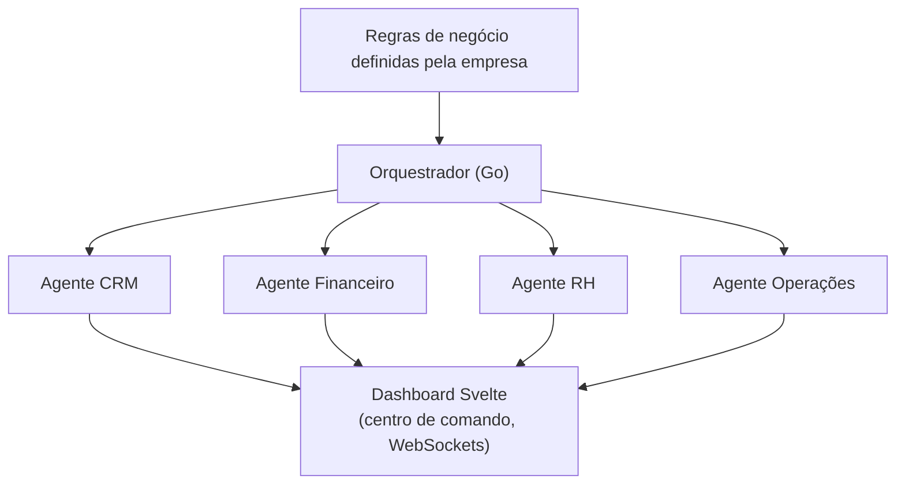

# Fase 3 — Fecho do Círculo Operacional (O ERP)

> **Objetivo:** transformar o AegisPass no "sistema operativo" da empresa —
> faturação, contabilidade, banca e um **orquestrador multi-agente** autónomo.

## Âmbito (in scope)

- Módulo de Faturação e Contabilidade
- Integração bancária (Open Banking) + cartões virtuais efémeros — ver [`epic-fintech`](../03-epics/epic-fintech.md)
- **Orquestrador de Agentes (multi-agente)** em Go — ver [`epic-agents`](../03-epics/epic-agents.md)
- "Modo Autónomo": empresa define regras e os agentes operam rotinas diárias
- Agentes especializados: CRM, Financeiro, RH, Operações/Logística

## Modelo de orquestração

Ver [`agents-architecture`](../01-architecture/agents-architecture.md) para o
detalhe técnico (EDA, Guardião, segurança com LLMs).

## Definition of Done (Fase 3)

- [x] Faturação completa (pro-forma → fatura → recibo) com numeração legal (`FIN-006`, `/fin/invoices`).
- [x] Reconciliação bancária — **mock Open Banking em dev** (`/fin/banking`); produção: `FIN-003` + TPP.
- [x] Orquestrador executa `deal_closed → fatura → pagamento → comissão` com HITL — ver
  [`journey-erp-flow-dev.md`](../04-user-journeys/journey-erp-flow-dev.md).
- [x] Guardião auditável sem Master Key nos logs (`/security/guardian`, `GET /api/agent/audit`).
- [x] Relatório RGPD — sugestão orquestrador + PDF em `/hr/compliance` (HR-008).
- [x] Categorização fiscal de subscrições SaaS (`FIN-005`, `/fin/fiscal`) — ZK no cliente.

> Desenvolvimento local sem VPS: [`development-without-vps.md`](../08-dev-environment/development-without-vps.md)

## Riscos principais

| Risco | Mitigação |
|---|---|
| Agente de IA toma decisão errada/cara | "Human-in-the-loop" obrigatório em ações financeiras; limites por política |
| LLM expõe dados sensíveis | Guardião com menor privilégio; modelos locais isolados |
| Complexidade de ERP descontrola scope | Entregar módulo a módulo; cada um com valor isolado |

## Visão de longo prazo (pós-Fase 3)

- Mais agentes verticais (jurídico, marketing, suporte).
- Marketplace de skills/conectores.
- Selo "AegisPass Compliant" + seguro cibernético integrado.
