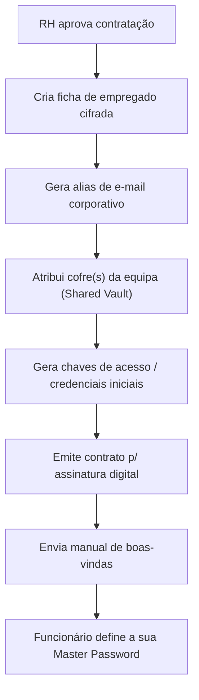
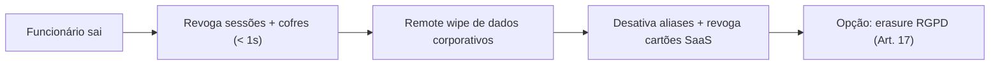

# Journey: Onboarding de novo funcionário

> **Ator:** Admin/RH · **Epics:** `HR`, `VAULT`, `MAIL`

O "Dashboard de Integração" promete fazer num clique o que normalmente são horas
de trabalho manual em vários sistemas.

## Fluxo principal

## Passo-a-passo

1. RH aprova a contratação no painel.
2. Sistema cria a ficha cifrada (campos sensíveis cifrados no cliente).
3. Gera o alias (`nome@empresa.com`) — ver [`MAIL`](../03-epics/epic-aliases-email.md).
4. Atribui acesso aos cofres partilhados da equipa.
5. Emite contrato para assinatura digital (ficheiro com chave própria).
6. O funcionário recebe convite, instala a app e **define a sua Master
   Password** (só aí nasce a Master Key, no dispositivo dele).

## Conceito didático

> 💡 **Porque é o funcionário a definir a Master Password?** No modelo
> Zero-Knowledge, se o admin a definisse, o admin conheceria a chave. Ao deixar
> o próprio funcionário criá-la no primeiro acesso, garantimos que **ninguém**
> além dele a conhece — nem o admin, nem o servidor.

## Offboarding (o inverso)

Ver [`journey-remote-wipe.md`](journey-remote-wipe.md) e
[`journey-rgpd-erasure.md`](journey-rgpd-erasure.md).
