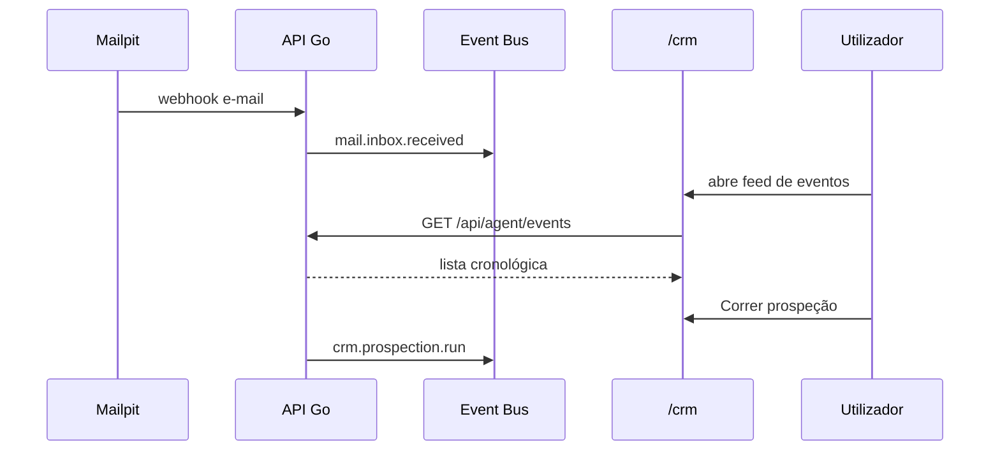
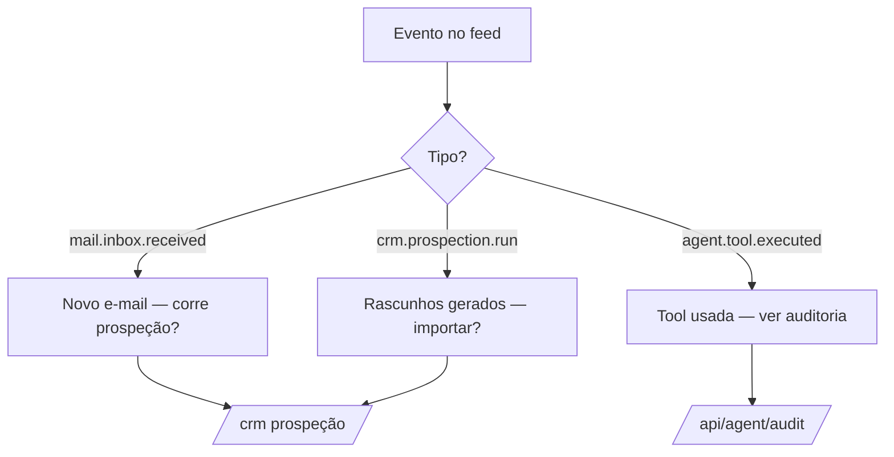

# Journey: Feed de acções dos agentes (AGENT-004)

> **Ator:** Utilizador / supervisor · **Epics:** `AGENT`, `MAIL`, `CRM`

Supervisiona o que os agentes e o pipeline de mail fazem — sem formulários
monolíticos, através de um **feed de eventos** auditável.

## Pré-condições

- Sessão activa.
- Event Bus ligado (arranque com base de dados).

## Fluxo principal

## Mapa mental do feed (flowchart)

## Passo-a-passo

1. Recebe e-mail no alias → evento `mail.inbox.received` no feed.
2. Abre `/crm` — painel «Actividade dos agentes» mostra eventos recentes.
3. Clica **Correr prospeção** → novo evento `crm.prospection.run`.
4. Importa leads — funil actualiza (cifragem local).
5. Opcional: `GET /api/agent/audit` para detalhe de tools.

## Pós-condições

- Histórico em `agent_events` (append-only).
- Base para orquestrador AGENT-005 (subscritores automáticos).
