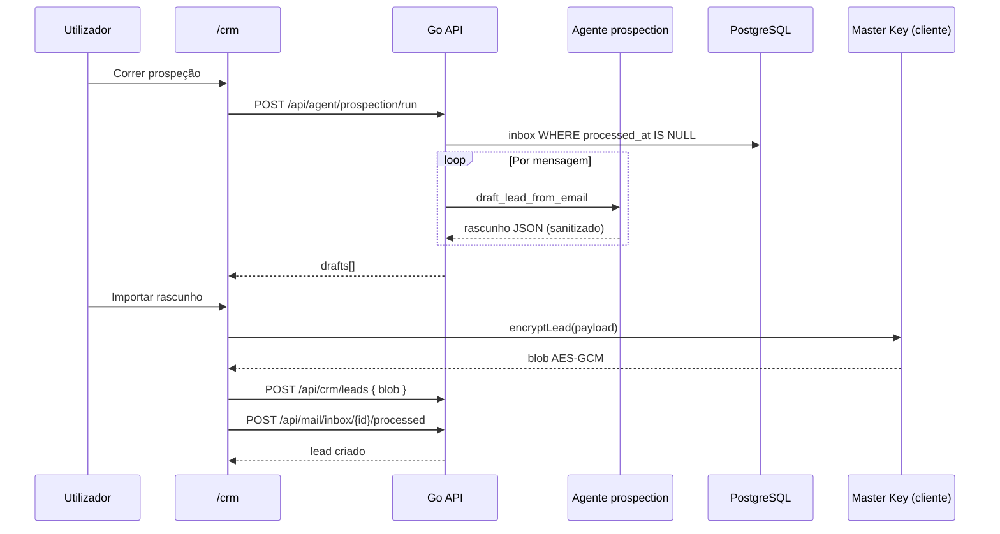
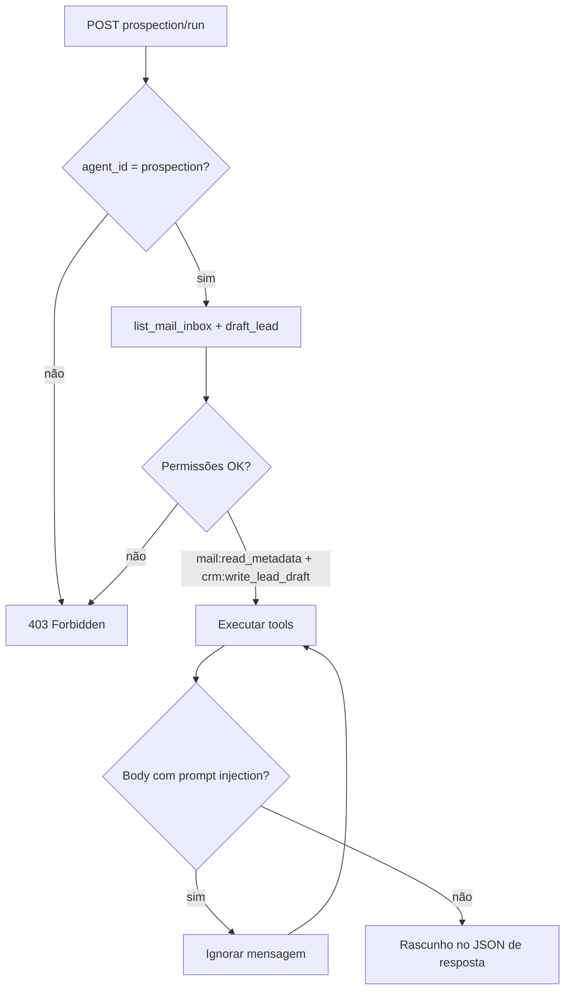
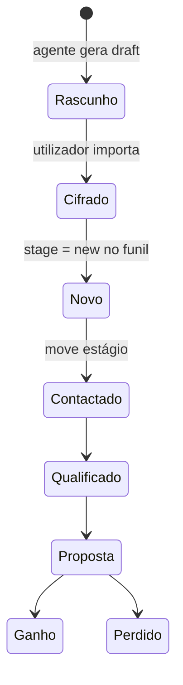

# Journey: Prospeção automática — e-mail → lead cifrado (AGENT-003)

> **Ator:** Comercial / gestor de vendas · **Epics:** `AGENT`, `CRM`, `MAIL`

O agente de prospeção lê e-mails pendentes na inbox, gera rascunhos de lead e o
utilizador importa para o funil CRM com cifragem Zero-Knowledge no browser.

## Pré-condições

- Cofre **desbloqueado** (Master Key em memória).
- Mensagens na inbox (`/mail`) com estado **pendente**.
- Agente `prospection` autorizado pelo Guardião (AGENT-002).

## Fluxo principal (sequence)

## Fluxograma do Guardião e tools

## Diagrama de estados (lead)

## Passo-a-passo

1. Garante e-mails na inbox (SMTP para alias ou simulação em dev).
2. Abre `/crm` com cofre desbloqueado.
3. Clica **Correr prospeção** — o servidor devolve rascunhos (não grava PII em claro no CRM).
4. Revê cada rascunho (e-mail, assunto, notas sanitizadas).
5. **Importar para o funil** — o cliente cifra e grava o blob.
6. A mensagem de inbox fica **processada**; nova prospeção não a repete.

## Conceito didático

> 💡 **Function calling:** o agente não escreve na BD directamente — pede tools
> validadas (`list_mail_inbox`, `draft_lead_from_email`) com schemas JSON.

> ⚠️ **Segurança:** conteúdo de e-mail passa por `SanitizeExternalContent` e
> `RejectIfLooksLikeInstruction` (AGENT-010). Leads no CRM são sempre blobs opacos.

## Fluxos alternativos

- **Cofre bloqueado:** importação falha — só metadados de rascunho visíveis até unlock.
- **Sem e-mails pendentes:** prospeção devolve lista vazia.
- **Rate limit (MAIL-005):** ingest bloqueada antes de chegar à inbox.

## Pós-condições

- Lead no funil CRM (cifrado).
- Entrada em `GET /api/agent/audit` para `prospection_run`.
- Mensagem de inbox marcada processada.
