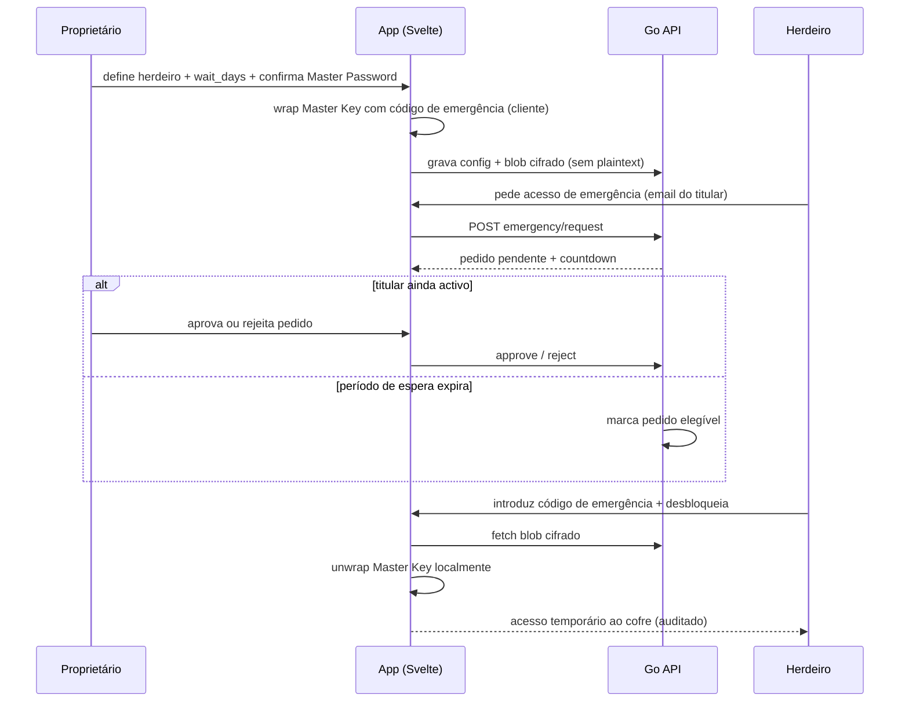

# Journey: Acesso de emergência (herdeiro digital)

> **Ator:** Proprietário do cofre · Herdeiro designado · **Epics:** `VAULT`

Permite que uma pessoa de confiança aceda ao cofre se o titular estiver
incapacitado — com **período de espera** configurável e aprovação do titular
se ainda estiver activo.

## Pré-condições

- O proprietário configurou herdeiro e dias de espera em `/security/emergency`.
- Foi gerado um **código de emergência** (envelope da Master Key cifrado).

## Fluxo principal

## Passo-a-passo

1. O proprietário, com cofre desbloqueado, define o e-mail do herdeiro e o
   **wait_days** (ex.: 7 dias).
2. No cliente, a Master Key é envolvida num envelope cifrado com um código de
   emergência — só o blob vai para o servidor.
3. O herdeiro inicia pedido em `/security/emergency`; começa a contagem decrescente.
4. Se o titular estiver disponível, **aprova ou rejeita** antes do fim do prazo.
5. Após elegibilidade, o herdeiro usa o código (entregue offline) para unwrap
   local da Master Key e aceder ao cofre — tudo auditado.

## Conceito didático

> 💡 **Herdeiro digital:** pessoa pré-autorizada com acesso *adiado*, não imediato.
> O período de espera dá ao titular tempo para cancelar um pedido fraudulento.

> ⚠️ **Segurança:** o código de emergência deve ser guardado **fora da app**
> (papel, cofre físico). Quem o tiver + elegibilidade temporal pode recuperar
> a Master Key — trata-o como segredo de nível máximo.

## Fluxos alternativos

- **Titular rejeita:** pedido cancelado; herdeiro notificado.
- **Titular recupera conta:** pode revogar configuração de emergência a qualquer momento.
- **Código errado:** unwrap falha no cliente; sem tentativas ilimitadas no servidor.

## Pós-condições

- Acesso de emergência registado no log imutável.
- Configuração revogável pelo titular sem expor o código em claro no servidor.
