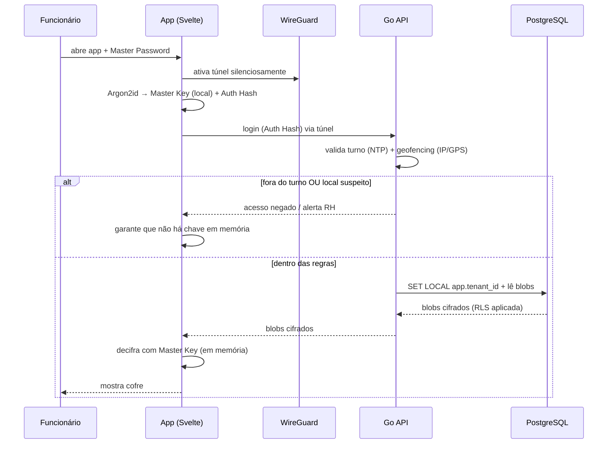

# Journey: Funcionário acede ao cofre (BYOD)

> **Ator:** Funcionário · **Dispositivo:** pessoal (BYOD) · **Epics:** `VAULT`

Mostra como o Zero-Trust se aplica na prática: rede, identidade, contexto e
cifragem, por camadas.

## Pré-condições

- A empresa (tenant) está provisionada.
- O funcionário tem a app AegisPass instalada e perfil WireGuard.
- Está dentro do horário de turno definido pelo admin.

## Fluxo principal (happy path)

## Passo-a-passo

1. Funcionário abre a app e insere a Master Password.
2. A app ativa o WireGuard em background (sem o túnel, a API é inalcançável).
3. Localmente, deriva a Master Key (fica no dispositivo) e o Auth Hash (enviado).
4. A API valida: sessão + **turno** (relógio NTP do servidor) + **geofencing**.
5. Se passar, a BD devolve blobs cifrados (RLS garante isolamento do tenant).
6. O Svelte decifra em memória e mostra os dados — que nunca tocam o disco.

## Fluxos alternativos

- **Fora do turno:** acesso negado; a chave de desencriptação é negada/expurgada.
- **Local geograficamente impossível:** Sentinel Mode exige prova adicional.
- **Sem VPN:** a API nem é alcançável (a porta está fechada à internet).

## Pós-condições

- Acesso registado num log imutável.
- Ao fim do turno/bloqueio, a Master Key é descartada da memória.

> ⚠️ **Segurança:** repara que existem **5 barreiras** independentes (VPN →
> auth → turno → geofencing → cifragem). Mesmo que uma falhe, as outras seguram.
