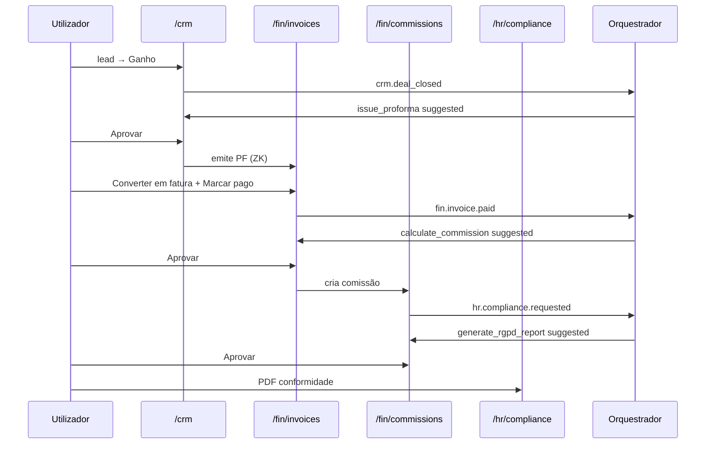

# Journey: Fluxo ERP em desenvolvimento (DoD Fase 3)

> **Ator:** Gestor comercial/financeiro · **Epics:** CRM, FIN, HR, AGENT

Ciclo completo com orquestrador e human-in-the-loop — **sem** banco nem VPS real.

## Pré-condições

- Master Key desbloqueada.
- Backend com orquestrador activo (`docker compose`).

## Fluxo principal

## Passo-a-passo

1. **CRM** — cria lead; move para **Ganho**; aprova **emitir pro-forma**.
2. **Faturas** — converte PF→FT; preenche linhas se necessário; **Marcar pago**.
3. Aprova **calcular comissão** (10% vendedor por omissão em dev).
4. **Comissões** — confirma registo; aprova **relatório RGPD**.
5. **Conformidade** — imprime PDF (`Ctrl+P` → Guardar como PDF).

## Recibo (RC)

Em `/fin/invoices`, em fatura **paga**, clica **Emitir recibo**.

## Reconciliação (opcional)

`/fin/banking` → consentimento mock → sync → reconcilia com subscrições SaaS.

## Pós-condições

- Eventos auditados em `agent_events`.
- Nenhuma acção financeira automática sem aprovação humana.
