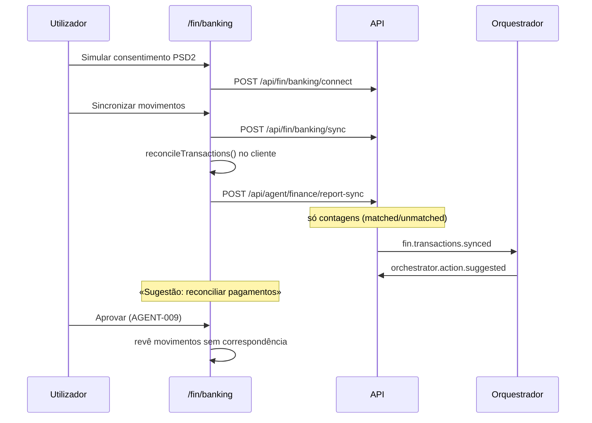

# Journey: Agente financeiro reconcilia pagamentos (FIN-003 / AGENT-006)

> **Ator:** Responsável financeiro · **Epics:** `AGENT`, `FIN`

Liga uma conta bancária (mock em dev), sincroniza movimentos e cruza débitos com
subscrições SaaS. O orquestrador sugere reconciliação — sem alterar dados automaticamente.

> 💡 **Conceito:** Open Banking — regulação PSD2 que permite acesso a movimentos
> com consentimento do titular, via APIs mTLS entre TPP e banco.

## Pré-condições

- Orquestrador activo com worker `finance` (AGENT-005).
- Subscrições em `/fin` com custos mensais definidos.
- Master Key desbloqueada.

## Fluxo principal

## Passo-a-passo

1. Em `/fin`, abre **Open Banking**.
2. Clica **Simular consentimento PSD2** — estado passa a `connected`.
3. **Sincronizar movimentos** — recebe transacções mock (Netflix, Spotify, AWS…).
4. O cliente associa débitos a subscrições pelo valor mensal.
5. No feed, aparece **Sugestão: reconciliar pagamentos**.
6. **Aprova** — revê os movimentos «sem correspondência» manualmente.

## Pós-condições

- Metadados de ligação em `bank_connections` (sem tokens em claro).
- Evento `fin.transactions.synced` auditado; movimentos não persistidos no servidor.

> ⚠️ **Segurança:** provider real e certificados mTLS (`AEGIS_OB_*`) ficam para
> quando INFRA-002 (WireGuard) e credenciais de TPP estiverem disponíveis.
