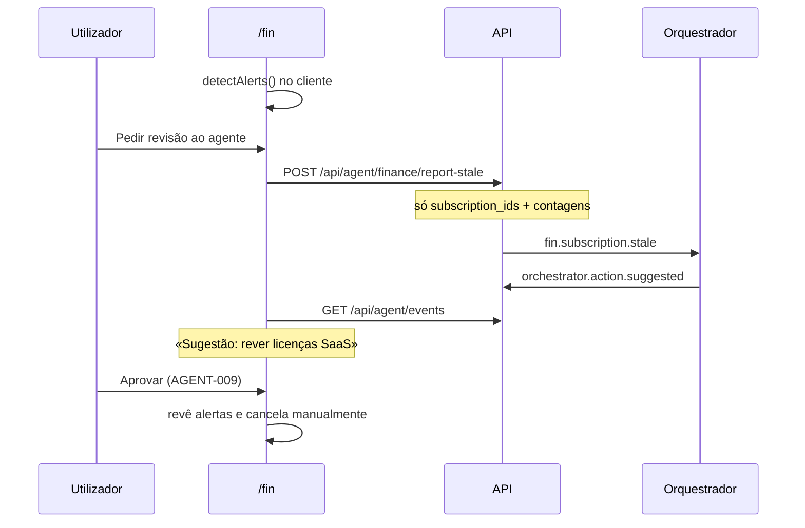

# Journey: Agente financeiro sugere rever licenças SaaS (AGENT-006)

> **Ator:** Responsável financeiro · **Epics:** `AGENT`, `FIN`

Quando o dashboard detecta subscrições sem uso ou sem login no cofre, o
utilizador pode reportar os alertas ao orquestrador. O agente financeiro
sugere uma revisão — sem cancelar licenças automaticamente.

> 💡 **Conceito:** Zero-Knowledge — o servidor recebe apenas IDs de subscrição;
> nomes, custos e credenciais nunca saem do browser em claro.

## Pré-condições

- Orquestrador activo com worker `finance` (AGENT-005).
- Subscrições registadas em `/fin` com Master Key desbloqueada.
- Pelo menos um alerta (licença «stale» ou «orphan»).

## Fluxo principal

## Passo-a-passo

1. Adiciona subscrições com custo e data de último uso antiga (ou sem login no cofre).
2. O painel **Alertas** lista licenças candidatas a poupança.
3. Clica **Pedir revisão ao agente** — envia só IDs ao servidor.
4. No feed **Actividade dos agentes**, aparece **Sugestão: rever licenças SaaS**.
5. **Aprova** — revê a lista e desactiva/cancela subscrições inactivas manualmente.

## Pós-condições

- Evento `fin.subscription.stale` auditado em `agent_events`.
- Nenhuma licença cancelada automaticamente; decisão final do utilizador.

> ⚠️ **Segurança:** reconciliação bancária completa (FIN-003 / Open Banking) fica
> para fase posterior — este journey cobre apenas alertas SaaS no cliente.
