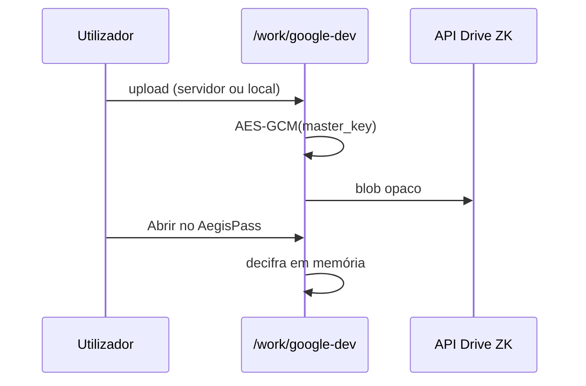

# Journey: Google proxy em desenvolvimento (DoD Fase 2)

> **Ator:** Administrador · **Substitui:** GOOGLE-002–003 até APIs reais · Estado OAuth: `/work/google`

Simula Drive cifrado e mascaramento Sheets **sem** ligar à Google.

## Pré-condições

- Master Key desbloqueada.
- `docker compose up` (opcional — tudo corre no browser).

## Fluxo — Drive

## Fluxo — Sheets

1. Cola texto com NIF `123456789` e IBAN `PT50…`.
2. Vê **tokens** (`TOKEN_NIF_*`) — o que a Google guardaria.
3. Vê **vista AegisPass** com valores reais reinjetados.

## Pós-condições

- Nenhum dado enviado à Google.
- Padrão de tokenização reutilizável quando `GOOGLE-003` for implementado.

> 💡 **Conceito:** em produção o mapa token→valor ficará no PostgreSQL cifrado, não no browser.
