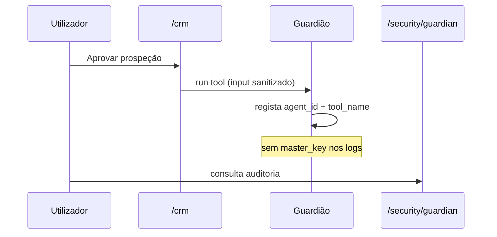

# Journey: Auditoria do Guardião (DoD Fase 3)

> **Ator:** Admin de segurança · **Epic:** AGENT-002

Demonstra que agentes executam **tools** sem aceder à Master Key.

## Pré-condições

- Sessão activa.
- Pelo menos uma prospeção ou recrutamento executado.

## Fluxo

## O que verificar

| Campo | Esperado |
|---|---|
| `agent_id` | ex. `prospection` |
| `tool_name` | ex. `list_mail_inbox` |
| `success` | true/false |
| Ausente | passwords, blobs decifrados, Master Key |

## Passo-a-passo

1. Corre prospeção em `/crm` (com e-mail simulado via Mailpit).
2. Abre `/security/guardian`.
3. Confirma entradas recentes — só metadados.

> ⚠️ **Segurança:** o Guardião decifra no cliente ou via scoped context; o servidor de auditoria
> nunca persiste conteúdo sensível das tools.
