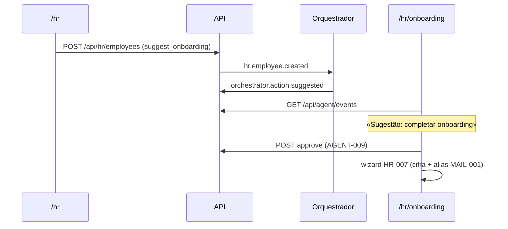

# Journey: Agente RH sugere onboarding (AGENT-007)

> **Ator:** Administrador RH · **Epics:** `AGENT`, `HR`, `MAIL`

Quando crias uma ficha vazia em `/hr`, o orquestrador sugere «completar onboarding»
no feed — sem cifrar campos automaticamente (Zero-Knowledge).

## Pré-condições

- Orquestrador activo com worker `onboarding` (AGENT-005).
- Master Key desbloqueada para cifrar campos no cliente.

## Fluxo principal

## Passo-a-passo

1. Em **Fichas** (`/hr`), clica **Nova ficha** — cria registo vazio e dispara o evento.
2. Abre **Onboarding** (`/hr/onboarding`) — vês a sugestão no feed.
3. Clica **Aprovar** — decisão auditada (AGENT-009).
4. Preenche nome, e-mail e função — o wizard reutiliza a ficha aprovada.
5. Alias de e-mail gerado (MAIL-001) com reencaminhamento.

Alternativa: **Rejeitar** — sugestão fica marcada, sem wizard automático.

## Pós-condições

- Ficha com campos cifrados campo-a-campo (HR-001).
- Alias activo no registo imutável (HR-002).
- Nenhum PII em claro no servidor.
