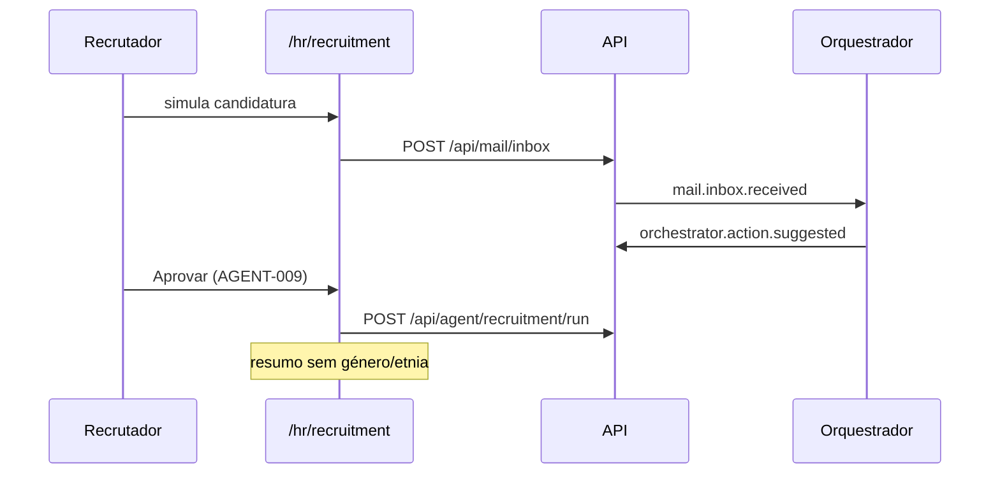

# Journey: Agente RH — triagem às cegas (AGENT-007)

> **Ator:** Recrutador · **Epics:** `AGENT`, `HR`, `MAIL`

Candidaturas por e-mail passam por triagem às cegas: género, etnia e idade
são ocultados antes do resumo chegar ao recrutador (CT-RGPD-04).

## Pré-condições

- Orquestrador com worker `recruitment` (AGENT-005).
- E-mail de candidatura na inbox (simulado ou MAIL-002).

## Fluxo principal

## Passo-a-passo

1. Em **Recrutamento**, simula um e-mail com «Candidatura» no assunto.
2. No feed, **Aprovar** a sugestão de triagem às cegas.
3. Clica **Correr triagem** — vês rascunhos com campos sensíveis `[oculto]`.
4. Marca como processada quando concluíres a análise.

## Pós-condições

- Nenhum campo de género/etnia visível no resumo apresentado.
- Eventos auditados no feed (AGENT-004).
