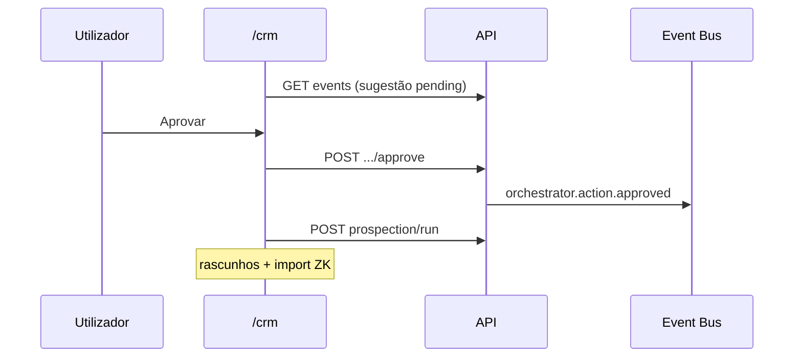

# Journey: Aprovar sugestão do orquestrador (AGENT-009)

> **Ator:** Utilizador comercial · **Epics:** `AGENT`, `CRM`

O feed em `/crm` mostra sugestões com botões **Aprovar** / **Rejeitar**. Só após
aprovação é que a prospeção corre no cliente (Master Key necessária).

## Pré-condições

- Orquestrador activo (AGENT-005).
- E-mail ingerido ou simulado → sugestão `run_prospection` no feed.

## Fluxo principal

## Passo-a-passo

1. Simula ou recebe e-mail no alias.
2. Abre `/crm` — vês **Sugestão: correr prospeção** com botões.
3. Clica **Aprovar** — decisão fica auditada.
4. A prospeção corre automaticamente (precisas do cofre desbloqueado).
5. Importa rascunhos para o funil.

Alternativa: **Rejeitar** — sugestão fica marcada como rejeitada, sem prospeção.

## Pós-condições

- Eventos `approved` / `rejected` em `agent_events`.
- Nenhuma tool ZK executada sem clique humano.
