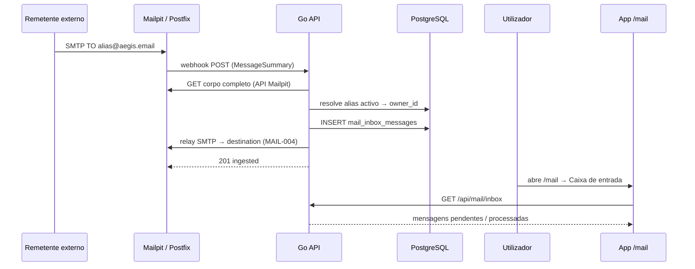
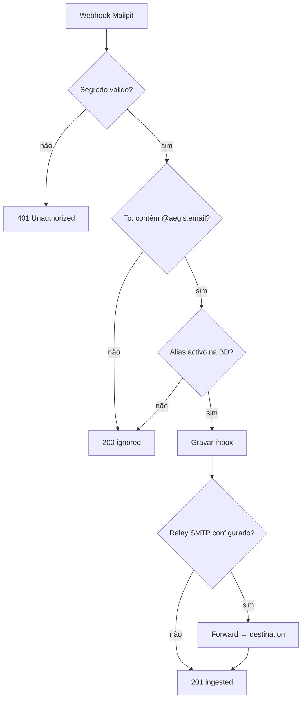
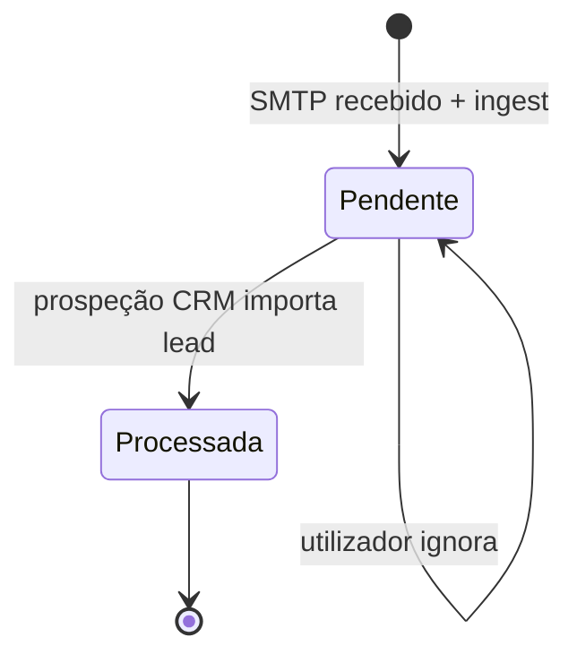

# Journey: Alias de e-mail com relay e inbox (MAIL-001/002/004)

> **Ator:** Utilizador BYOD · **Epics:** `MAIL`, `AGENT`

Protege o e-mail real com aliases `@aegis.email`: mensagens recebidas entram na
inbox da app, reencaminham para o destino configurado e alimentam o agente de
prospeção no CRM.

## Pré-condições

- Conta AegisPass com sessão activa.
- Alias criado em `/mail` com destino real (ex.: Gmail corporativo).
- Em dev: Mailpit a correr (`docker compose up`).

## Fluxo principal (sequence)

## Fluxograma de decisão (ingestão)

## Diagrama de estados (mensagem na inbox)

## Passo-a-passo

1. Em `/mail`, gera um alias e copia `xxxx@aegis.email`.
2. Configura o **destino** (e-mail real) — visível ao servidor para relay.
3. Envia e-mail para o alias (SMTP dev: `localhost:1025`).
4. O backend **ingere** na inbox e **reencaminha** cópia para o destino.
5. Em `/mail` vês a mensagem como **pendente**.
6. Em `/crm`, corre **prospeção** e importa o lead (cifragem local).
7. A mensagem passa a **processada**.

## Conceito didático

> 💡 **Alias:** endereço descartável que esconde o e-mail real perante terceiros.
> Se o alias vazar, desligas só esse endereço.

> ⚠️ **Segurança:** o corpo do e-mail no relay é excepção consciente ao
> Zero-Knowledge (como o destino do alias). Leads no CRM permanecem sempre
> cifrados com a Master Key no cliente.

## Fluxos alternativos

- **Alias desligado:** ingest ignora; relay não corre.
- **Relay falha:** inbox grava na mesma — o utilizador não perde a mensagem na app.
- **MAIL-005:** rate limit bloqueia abuso antes de ingest/relay.

## Pós-condições

- Cópia na inbox do tenant + cópia no e-mail real (se relay activo).
- Mensagem pronta para AGENT-003 (prospeção → lead cifrado).
