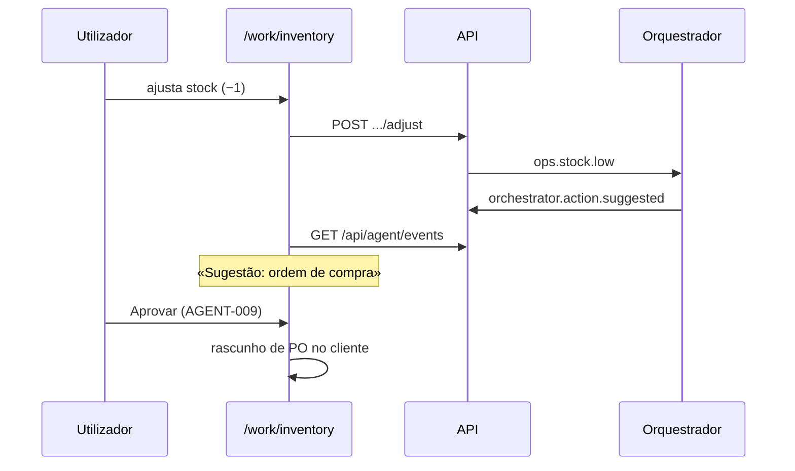

# Journey: Agente de operações sugere ordem de compra (AGENT-008)

> **Ator:** Responsável de operações · **Epics:** `AGENT`, `WORK`

Quando o stock de um artigo desce ao nível de reordenação, o orquestrador
sugere uma ordem de compra — sem enviar automaticamente a fornecedores.

## Pré-condições

- Orquestrador activo com worker `operations` (AGENT-005).
- Artigos registados em `/work/inventory`.

## Fluxo principal

## Passo-a-passo

1. Adiciona artigos com quantidade e nível de reordenação.
2. Simula consumo com **−1** até `quantity <= reorder_level`.
3. No feed, aparece **Sugestão: ordem de compra**.
4. **Aprova** — gera rascunho com quantidade sugerida (stub local).
5. Envia manualmente ao fornecedor (fora do scope desta fase).

## Pós-condições

- Evento `ops.stock.low` auditado em `agent_events`.
- Rascunho de PO visível na UI; nenhuma encomenda automática.
