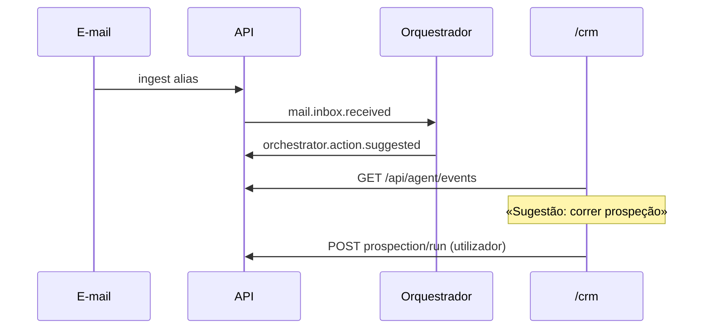

# Journey: Orquestrador sugere próximo passo (AGENT-005)

> **Ator:** Utilizador comercial · **Epics:** `AGENT`, `MAIL`, `CRM`

Quando chega e-mail ao alias, o orquestrador sugere «correr prospeção» no feed —
sem executar acções que exijam Master Key automaticamente.

## Pré-condições

- Event Bus activo (AGENT-004).
- Orquestrador arrancado com worker `prospection`.

## Fluxo principal

## Passo-a-passo

1. Recebe e-mail no alias (SMTP ou simulação).
2. Abre `/crm` — feed mostra **Sugestão: correr prospeção**.
3. Clica **Correr prospeção** (acção humana).
4. Importa rascunhos com cifragem local.

## Pós-condições

- Sugestão auditada em `agent_events`.
- Utilizador mantém controlo (AGENT-009 preparado).
