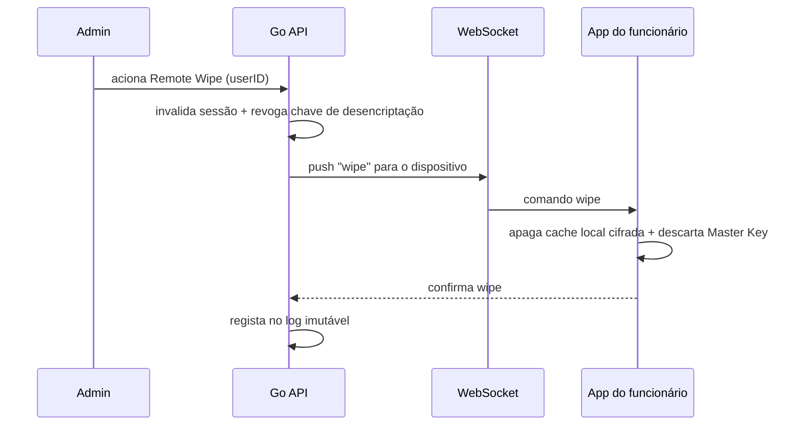

# Journey: Remote Wipe de dados corporativos

> **Ator:** Admin/RH · **Epics:** `VAULT`, `HR`

Apagar os dados da empresa do dispositivo pessoal do funcionário **sem tocar nas
fotos/apps pessoais** — o isolamento total sem MDM do telemóvel inteiro.

## Gatilhos

- Funcionário sai da empresa.
- Dispositivo perdido/roubado.
- Geofencing deteta saída de zona segura ou Wi-Fi suspeito (automático).

## Fluxo principal

## Passo-a-passo

1. Admin aciona o wipe (ou o geofencing dispara automaticamente).
2. A API **invalida a sessão e revoga a chave** — mesmo que o wipe físico
   falhe, os dados em cache ficam inúteis (estão cifrados).
3. Via WebSocket, o dispositivo recebe a ordem e limpa o armazenamento local da
   app + descarta a Master Key.
4. A ação fica registada no log imutável de auditoria.

## Conceito didático

> 💡 **WebSocket:** ao contrário do HTTP normal (cliente pergunta, servidor
> responde), o WebSocket mantém um canal **bidirecional aberto**. Isto permite ao
> servidor "empurrar" (push) a ordem de wipe para o dispositivo em < 1s, sem o
> dispositivo ter de andar a perguntar.

> ⚠️ **Segurança — defesa em profundidade:** não confiamos só no wipe físico
> (o dispositivo pode estar offline). A revogação da **chave** no servidor é a
> garantia real: sem chave, a cache cifrada é lixo.

## Pós-condições

- Dados pessoais do funcionário intactos.
- Dados corporativos inacessíveis no dispositivo.
- Evento auditável.
