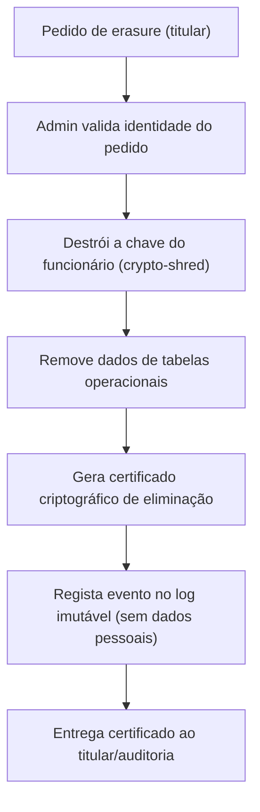

# Journey: Direito ao Esquecimento (RGPD Art. 17)

> **Ator:** Admin/RH (a pedido do titular dos dados) · **Epics:** `HR`

Apagar permanentemente todos os registos de um funcionário e provar que foi
feito — sem partir a cadeia de logs imutáveis.

## O dilema

> ⚠️ **Tensão de design:** o RGPD exige *apagar* dados pessoais (Art. 17), mas a
> auditoria exige logs *imutáveis*. Como apagar sem violar a imutabilidade?

**Solução — Crypto-shredding:** os dados pessoais já estão cifrados com uma
chave por funcionário. Para "apagar", **destruímos a chave**. Os blobs cifrados
podem permanecer (no log/backups), mas tornam-se matematicamente irrecuperáveis.

## Fluxo principal

## Passo-a-passo

1. Recebe-se o pedido de eliminação do titular.
2. Valida-se a identidade e a legitimidade do pedido.
3. **Destrói-se a chave** de cifragem do funcionário (crypto-shredding).
4. Removem-se os dados das tabelas operacionais.
5. Gera-se um **certificado criptográfico** de eliminação (prova para auditoria).
6. O evento entra no log imutável — registando *que* houve erasure, **sem**
   incluir dados pessoais.

## Conceito didático

> 💡 **Crypto-shredding:** se um dado está cifrado e ninguém tem a chave, ele é,
> na prática, irrecuperável. Apagar a chave (pequena) equivale a apagar os dados
> (potencialmente grandes e espalhados por backups). É a forma robusta de cumprir
> o "direito ao esquecimento" num sistema com backups imutáveis.

## Critérios de aceitação

- [ ] Após erasure, nenhum dado pessoal do titular é decifrável.
- [ ] O certificado é verificável e referencia o evento de log.
- [ ] A cadeia de logs continua íntegra (não foi adulterada).
