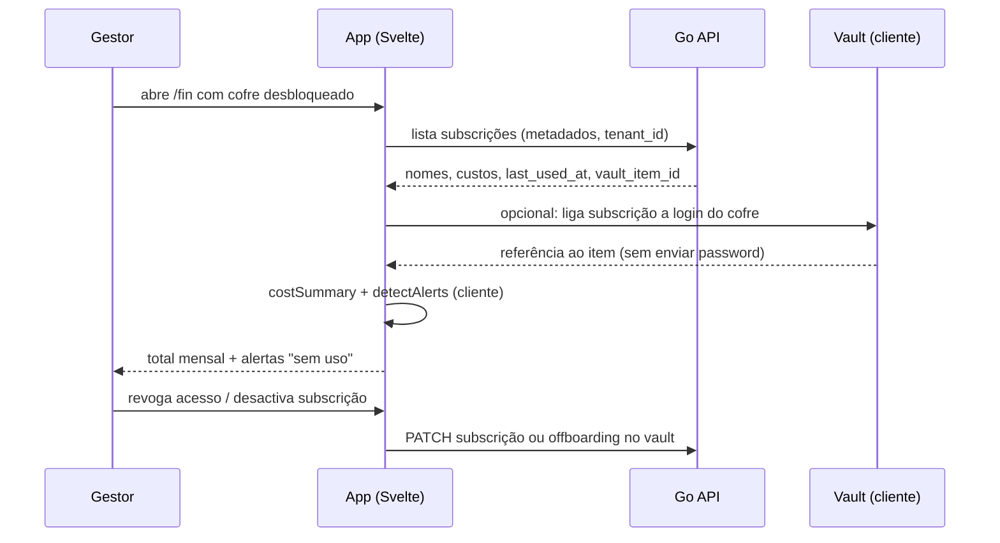

# Journey: Controlar custos SaaS e licenças sem uso

> **Ator:** Gestor / Admin financeiro · **Epics:** `FIN`, `VAULT`

Cruza subscrições SaaS com credenciais no cofre para ver gasto mensal e
alertar licenças pagas que ninguém usa — sem o servidor ver passwords.

## Pré-condições

- Cofre desbloqueado (Master Key em memória).
- Subscrições registadas em `/fin` com custo e ciclo de facturação.

## Fluxo principal

## Passo-a-passo

1. O gestor regista cada SaaS: nome, custo, moeda, ciclo (`monthly` / `yearly`),
   categoria e data de último uso.
2. Pode **associar** a subscrição a um item do cofre (login) — só o ID, não a
   password.
3. O cliente calcula `monthlyCost` e `detectAlerts`: licenças activas com
   `last_used_at` antigo ou inexistente.
4. O painel mostra totais por moeda e lista de alertas acionáveis.
5. Ao sair um funcionário, o offboarding pode desactivar subscrições ligadas
   ao mesmo tempo que revoga cofres.

## Conceito didático

> 💡 **Cruzamento vault + Fin:** o valor está em ligar **quem paga** (subscrição)
> a **quem usa** (login no cofre + `last_used_at`). O servidor gere contabilidade;
> o cliente decide o que é "uso" sem expor segredos.

> ⚠️ **Segurança:** custos e alertas são metadados de negócio — ainda assim
> filtramos por `tenant_id` + RLS. Credenciais SaaS permanecem cifradas no vault.

## Fluxos alternativos

- **Cofre bloqueado:** `/fin` mostra aviso; metadados de subscrições podem
  listar-se, mas ligação a logins exige unlock.
- **Sem vault_item_id:** alerta de custo funciona; higiene de password é manual.

## Pós-condições

- Visibilidade do gasto recorrente e licenças candidatas a corte.
- Acções de revogação alinhadas com auditoria e offboarding.

## Extensão: fiscal (FIN-005)

1. Em `/fin`, define **código fiscal** por subscrição (ou usa «sugerir»).
2. Em `/fin/fiscal`, revê totais **dedutíveis estimados** por mês.
3. Classificação fica no blob ZK — servidor não vê IRC em claro.

Ver [`journey-fiscal-categorization.md`](journey-fiscal-categorization.md).
