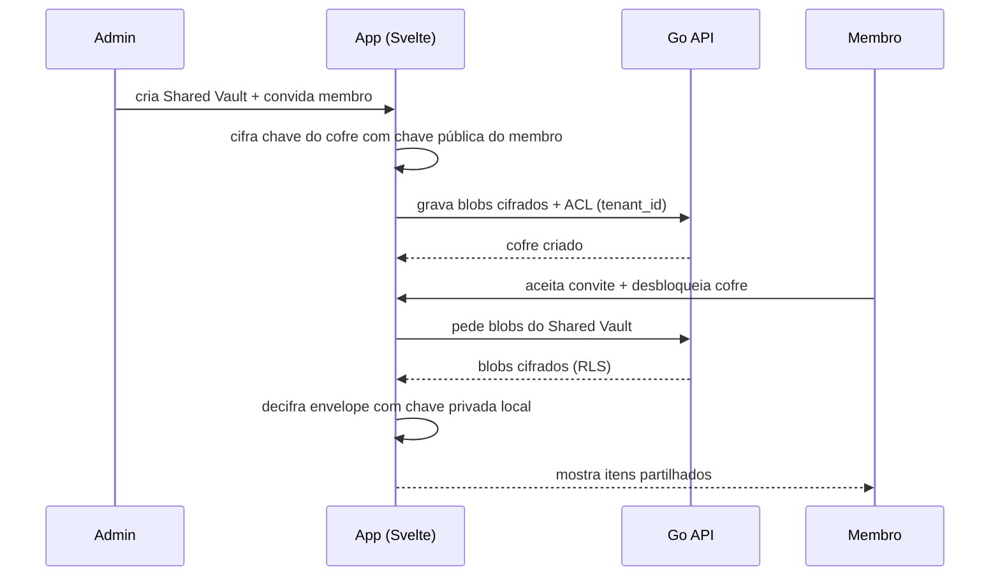

# Journey: Partilhar credenciais com a equipa (Shared Vault)

> **Ator:** Admin ou membro da equipa · **Epics:** `SHARE`, `VAULT`

Substitui o envio de passwords por chat ou e-mail: um cofre partilhado com
permissões explícitas e cifragem Zero-Knowledge para cada membro.

## Pré-condições

- O tenant tem pelo menos dois utilizadores com chaves assimétricas geradas.
- O admin (ou proprietário do cofre) tem permissão para convidar membros.

## Fluxo principal

## Passo-a-passo

1. O admin cria um **Shared Vault** em `/team/vaults` e define o papel de cada
   membro (ler, editar, administrar).
2. No cliente, a **chave simétrica do cofre** é re-cifrada para a chave pública
   de cada membro — o servidor só armazena envelopes, nunca a chave em claro.
3. O membro convidado aceita o convite; ao desbloquear o cofre pessoal, consegue
   decifrar o envelope com a sua chave privada (que nunca sai do dispositivo).
4. Alterações a itens são sincronizadas via WebSocket; revogação de acesso
   reflecte-se em segundos.

## Fluxos alternativos

- **Membro sai da equipa:** o admin revoga o acesso; envelopes desse membro
  deixam de ser úteis e o offboarding pode incluir remote wipe.
- **Sem Master Key desbloqueada:** o membro vê o cofre na lista mas não consegue
  ler itens até fazer unlock — a sessão HTTP sozinha não basta.

## Conceito didático

> 💡 **Re-cifragem assimétrica:** em Zero-Knowledge, partilhar um segredo não
> significa "enviar a password ao servidor". Significa cifrar a chave do item
> com a **chave pública** do destinatário. Só ele, com a chave privada local,
> consegue ler.

> ⚠️ **Segurança:** mesmo que a BD seja comprometida, os blobs do Shared Vault
> permanecem inúteis sem as chaves privadas de cada membro.

## Pós-condições

- Credenciais da equipa acessíveis só a membros autorizados.
- Evento de convite/revogação registado no log de auditoria.
