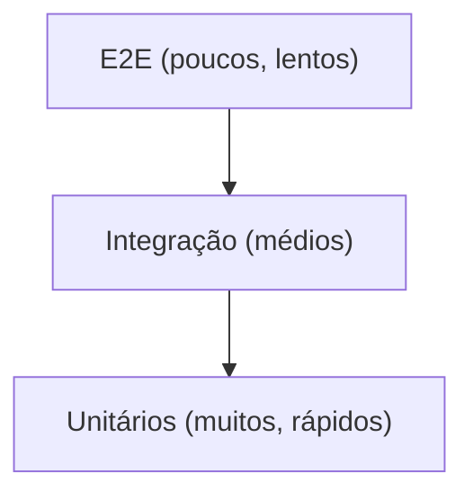

# Testes — Estratégia Geral

Num produto de segurança, **testar não é opcional**: um bug de cripto pode
expor todos os clientes. A estratégia segue a "pirâmide de testes".

> 💡 **Conceito — Pirâmide de testes:** muitos testes rápidos e baratos na base
> (unitários), menos no meio (integração), e poucos no topo (E2E, lentos/caros).
> Inverter a pirâmide (muitos E2E) torna a suite lenta e frágil.



## Níveis

| Nível | O que testa | Ferramentas |
|---|---|---|
| **Unitário** | Funções puras: cripto, derivação de chave, regex de masking | `go test` (Go), `vitest` (Svelte/TS) |
| **Integração** | API ↔ PostgreSQL, RLS, WebSockets | `go test` + container PostgreSQL (Testcontainers) |
| **E2E** | Fluxos completos (login → cofre, onboarding) | Playwright |
| **Segurança** | Pen-test, fuzzing, vetores cripto | ver [`security-testing.md`](security-testing.md) |
| **Conformidade** | RGPD (erasure, logs, cifragem) | ver [`rgpd-compliance-tests.md`](rgpd-compliance-tests.md) |

## Exemplo de teste unitário em Go (table-driven)

> 💡 **Conceito — Table-driven tests:** padrão idiomático de Go. Define-se uma
> *tabela* de casos e itera-se. Adicionar um caso novo é só acrescentar uma
> linha — muito legível e completo.

```go
func TestCifrarDecifrar(t *testing.T) {
    // Cada caso é uma entrada da "tabela". t.Run cria um sub-teste nomeado,
    // o que dá output claro sobre QUAL caso falhou.
    casos := []struct {
        nome      string
        plaintext []byte
    }{
        {"texto simples", []byte("ola mundo")},
        {"vazio", []byte("")},
        {"binário", []byte{0x00, 0xFF, 0x10}},
    }
    key := make([]byte, 32) // 256 bits
    for _, c := range casos {
        t.Run(c.nome, func(t *testing.T) {
            ct, err := Cifrar(key, c.plaintext)
            if err != nil {
                t.Fatalf("cifrar falhou: %v", err)
            }
            got, err := Decifrar(key, ct)
            if err != nil {
                t.Fatalf("decifrar falhou: %v", err)
            }
            // Comparar slices de bytes requer bytes.Equal (== não funciona em slices).
            if !bytes.Equal(got, c.plaintext) {
                t.Errorf("esperado %q, obtido %q", c.plaintext, got)
            }
        })
    }
}
```

## Metas de cobertura

| Área | Cobertura mínima |
|---|---|
| Core de criptografia | 95% |
| API / lógica de negócio | 80% |
| Frontend (lógica, não UI) | 70% |

## Definition of Done (testes) por task

- [ ] Testes unitários para a lógica nova.
- [ ] Teste de integração se toca BD/rede.
- [ ] Caso de segurança/abuso considerado (ver `security-testing.md`).
- [ ] CI verde (lint + test + build).
