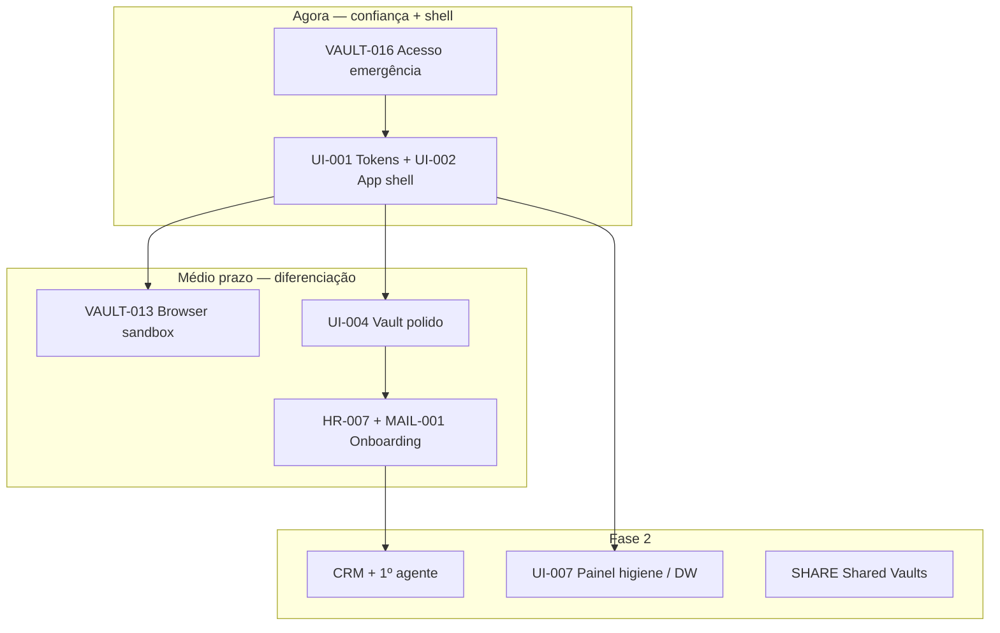

# Visão de Produto UI — AegisPass

> Documento de referência para design, frontend e product. Complementa o roadmap
> técnico (`05-tasks/backlog.md`) com a experiência que falta: hoje temos **motor
> cripto + API + playground**; falta a **app real**.

---

## 1. Onde estamos e para onde avançar

### 1.1 Estado actual (Fase 1)

| Área | Estado | Nota |
|---|---|---|
| Cripto ZK, cofre, sync, 2FA, turnos, geofence, wipe | 🟢 | Core sólido |
| Passkeys, recovery, CLI mTLS, import CSV | 🟢 | |
| Playground dev (`App.svelte`) | 🟢 | UI de teste — **não é produto** |
| Browser sandbox (VAULT-013) | ⚪ XL | Diferenciador BYOD |
| Acesso emergência (VAULT-016) | ⚪ L | Confiança empresarial |
| RH, Mail, infra VPS/WireGuard | ⚪ | Fecha Fase 1 comercializável |
| Design system / app real | 🟡 | Tokens + shell 🟢; `lib/ui/` + nav hierárquica ⚪ — ver [`design-system.md`](design-system.md) |

### 1.2 Sequência recomendada



**Prioridade imediata:** VAULT-016 → epic **UI** (substituir playground) → VAULT-013 → HR/MAIL.

---

## 2. North Star de design

Não é “cyberpunk neon”. É **calma, confiança e precisão** — cofre suíço num dispositivo moderno.

| Princípio | Tradução UX |
|---|---|
| **Confiança visível** | Estados de cifragem, sessão, turno e geofence legíveis, nunca alarmistas |
| **Calma operacional** | Animações suaves, poucos modais, zero urgência falsa |
| **Densidade inteligente** | Admin vê muito; funcionário vê pouco (menor privilégio na UI) |
| **Zero-Knowledge honesto** | Master Password desbloqueia localmente; passkey autentica servidor |
| **BYOD nativo** | Mobile-first funcionário; desktop expandido admin/RH |
| **Futuro = fluidez** | 60fps, transições físicas subtis, feedback imediato |

**Personalidade:** Proton × Linear × Apple Wallet — **seguro, premium, silencioso**.

---

## 3. Referências de design

### 3.1 Segurança & cofres

| Referência | Absorver | Evitar |
|---|---|---|
| **1Password** | Vaults, detalhe de item, gerador | Complexidade de pricing |
| **Bitwarden** | Clareza, fluxos simples | Estética genérica |
| **Proton Pass** | Tom privacidade premium, dark mode | Upsell agressivo |
| **Apple Passwords / Wallet** | Passkeys, biometria, micro-copy | Lock-in ecossistema |

### 3.2 Motion, spacing, smooth

| Referência | Absorver |
|---|---|
| **Linear** | Timing curves, hover, command palette, tipografia |
| **Raycast** | Micro-interações, keyboard-first |
| **Stripe Dashboard** | Hierarquia B2B, tabelas, empty states |
| **Vercel** | Dark UI, bordas subtis, gradientes discretos |
| **Things 3 / Craft** | Espaçamento generoso, navegação respirável |

### 3.3 Enterprise

| Referência | Absorver |
|---|---|
| **Rippling / Deel** | Wizard onboarding 1-clique |
| **Okta / Entra ID** | Políticas de acesso (simplificado) |
| **Notion** | Sidebar + páginas (versão mais leve) |

### 3.4 Guidelines obrigatórias

- Apple HIG — motion, touch targets, reduced motion
- Material Motion — easing, shared transitions
- **WCAG 2.2 AA** — contraste, foco
- **`prefers-reduced-motion`** — sempre respeitar

> ⚠️ **Segurança UX:** nunca animar passwords em claro; reveal intencional; clipboard com timeout visível.

---

## 4. Arquitectura de informação

### 4.1 Navegação top-level

A sidebar e os breadcrumbs seguem uma **árvore** (módulo → sub-páginas), não uma
lista plana. Mapa completo, componentes e migração em
[`design-system.md`](design-system.md).

```
COFRE      → Vault, itens, pesquisa, import
SEGURANÇA  → Higiene, breaches, dispositivos, sessões
TRABALHO   → Turnos, sandbox, CLI, passkeys
EQUIPA     → Shared vaults, secret links (Fase 2)
RH         → Fichas, contratos, onboarding, RGPD
FINANÇAS   → Custos SaaS, fiscal, faturas, banca (hub /fin)
CRM        → Leads, funil (Fase 2)
AGENTES    → Guardião, aprovações (Fase 2+)
ADMIN      → Tenant, políticas, audit, remote wipe
```

> 💡 **Conceito — Breadcrumb:** trilho `Finanças › Fiscal` que orienta o
> utilizador em sub-páginas sem repetir toda a sidebar. Fonte de verdade única:
> `ROUTE_TREE` (task UI-011).

### 4.2 Páginas Fase 1 (MVP comercial)

| Módulo | Páginas | Comportamentos |
|---|---|---|
| **Auth** | Welcome, Login, Register, Unlock, Recovery, Passkey | Progresso Argon2id honesto; unlock ≠ login |
| **Vault** | Lista, detalhe, criar/editar, pesquisa local | Decifragem lazy; TOTP inline; copy auto-clear |
| **Segurança** | Score higiene, dispositivos, sessões | Score no cliente |
| **Conta** | Passkeys, recovery, CLI devices | Revogar dispositivos |
| **Admin** | Utilizadores, turnos, geofence, wipe | Multi-step para acções destrutivas |
| **Settings** | Perfil, aparência, notificações | Modo light/dark/system + paletas (UI-013) |

### 4.3 Páginas Fase 1+

| Módulo | Páginas |
|---|---|
| Emergência (VAULT-016) | Herdeiro, countdown, aprovar/rejeitar |
| Sandbox (VAULT-013) | Browser isolado, injecção sem copy password |
| RH | Ficha, onboarding wizard, offboarding |

### 4.4 Tipos de item do cofre

| Tipo | Estado | Notas |
|---|---|---|
| `login`, `note`, `card` | 🟢 | Já no código |
| `ssh-key`, `api-token`, `wifi` | 🔜 | Expansão futura |

---

## 5. Design system — “Aegis Dark”

### 5.1 Cor

- **Base:** `#0B0F14` → `#121820` (não preto puro)
- **Superfícies:** camadas +1/+2/+3, border `1px` alpha 8–12%
- **Accent:** `#4DA3FF` — confiança, contido
- **Semântica:** verde suave (ok), âmbar (atenção), vermelho desaturado (perigo)
- **Gradientes:** só hero/empty states, opacidade ≤ 15%

### 5.2 Tipografia

| Role | Família | Uso |
|---|---|---|
| UI | Inter ou Geist | Corpo, labels |
| Display | Outfit ou SF Pro Display | Títulos |
| Mono | JetBrains Mono | Recovery codes, CLI, IDs |

Escala (rem, base 16): `xs 0.75` · `sm 0.875` · `base 1` · `lg 1.125` · `xl 1.25` · `2xl 1.5` · `3xl 1.875`

Line-height: corpo `1.6`, títulos `1.2`.

### 5.3 Espaçamento (grid 4px)

| Token | px | Uso |
|---|---|---|
| space-1 | 4 | Gap ícone-texto |
| space-2 | 8 | Inline |
| space-4 | 16 | Padding cards |
| space-6 | 24 | Entre secções |
| space-8 | 32 | Entre blocos |
| space-12 | 48 | Respiro de página |
| space-16 | 64 | Hero / empty |

**Dois modos:** listas densas (admin) vs cards espaçados (funcionário).

### 5.4 Radius & elevation

- `radius-sm 6px` · `md 10px` · `lg 16px`
- Preferir border + backdrop-blur a sombras pesadas

### 5.5 Componentes base

Button, Input, Card, ListRow, Badge, Modal, Toast, Skeleton, Progress (Argon2id), CommandPalette (⌘K).

Biblioteca reutilizável em `frontend/src/lib/ui/` — ver catálogo de componentes,
API e ordem de migração em [`design-system.md` §5](design-system.md) (tasks UI-012–017).

---

## 6. Motion & micro-animações

### 6.1 Timing

| Tipo | Duração | Easing |
|---|---|---|
| Micro (hover, toggle) | 120–180ms | power2.out |
| Panel / página | 280–380ms | power3.out |
| Modal enter | 320ms | back.out(1.2) suave |
| Modal exit | 220ms | power2.in |
| Lista stagger | 30–50ms/item | power1.out |

Regra: ≤ 400ms para acções frequentes.

### 6.2 Micro-interacções

| Momento | Comportamento |
|---|---|
| Login / unlock | Barra Argon2id + copy educativa |
| Item guardado | Checkmark + highlight fade |
| Copy password | Toast + countdown clipboard |
| Remote wipe | Overlay calmo, não alarmista |
| Fim de turno | Vault → locked state |
| WebSocket sync | Dot pulse no header |

### 6.3 Navegação relaxante

- Sidebar (desktop) + tab bar max 5 items (mobile)
- Cross-fade entre secções — evitar slide agressivo
- Command palette ⌘K para power users
- Banner calmo para offline/VPN — não modal bloqueante

### 6.4 Reduced motion

Respeitar `prefers-reduced-motion: reduce` em todas as animações (GSAP + CSS).

---

## 7. Layouts por persona

**Funcionário BYOD:** home = desbloquear ou últimos itens + pesquisa; ≤ 2 taps até TOTP.

**Admin / RH:** dashboard, tabelas, audit timeline vertical.

**Tenant owner:** conformidade, billing (futuro), políticas org-wide.

---

## 8. Stack UI (alinhada ao repo)

| Camada | Escolha |
|---|---|
| Framework | SvelteKit (migrar de Vite SPA) |
| Styling | CSS custom properties + tokens |
| Motion | GSAP + Svelte transitions |
| Icons | Lucide ou Phosphor |
| Mobile | Capacitor (previsto em `stack.md`) |
| Handoff | Figma variables espelhando tokens |

---

## 9. Checklist documentação viva

**Fase 1 — fundação (UI-001–010)**

- [x] Tokens implementados (`UI-001`)
- [x] App shell com routing (`UI-002`)
- [x] Auth flows substituem playground (`UI-003`)
- [x] Vault polido (`UI-004`)
- [x] Motion guidelines + reduced motion testado (`UI-005`)
- [x] Catálogo componentes dev (`UI-010`)
- [ ] Copy PT-PT estados segurança (unlock, wipe, turno)
- [ ] Lighthouse a11y ≥ 90 (auth + vault)
- [x] Playground movido para `/dev` ou desactivado em produção

**Fase 2 — design system aplicado (UI-011–017)** — detalhe em [`design-system.md` §9](design-system.md)

- [ ] `ROUTE_TREE` + sidebar hierárquica + breadcrumbs (`UI-011`)
- [ ] `lib/ui/` com componentes importáveis (`UI-012`)
- [ ] Paletas múltiplas + picker em `/settings` (`UI-013`)
- [ ] Hubs `/fin`, `/team` (`UI-014`)
- [ ] DataTable, MetricCard, ListRow (`UI-015`)
- [ ] Migração `/fin/*` para `PageShell` (`UI-016`)
- [ ] Toast, Skeleton, ConfirmDialog (`UI-017`)

---

## 10. Ligações

- Design system (plano operacional): [`design-system.md`](design-system.md)
- Backlog UI: [`../05-tasks/backlog.md`](../05-tasks/backlog.md) (prefixo `UI-*`)
- Epic Vault: [`../03-epics/epic-vault.md`](../03-epics/epic-vault.md)
- Performance: [`../07-non-functional/performance.md`](../07-non-functional/performance.md)
- Journey BYOD: [`../04-user-journeys/journey-employee-byod.md`](../04-user-journeys/journey-employee-byod.md)
