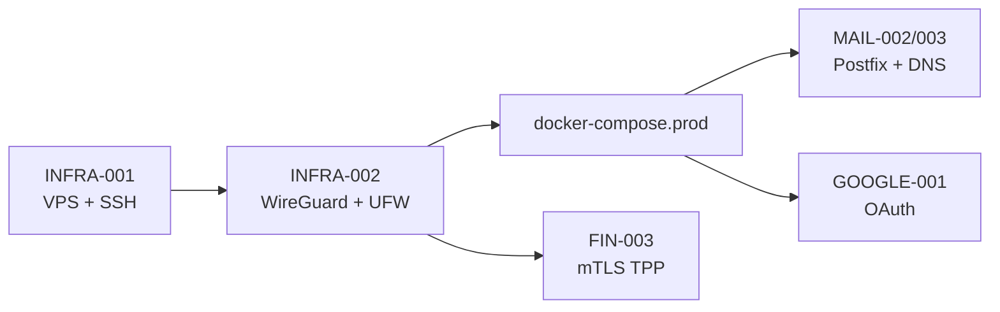

# Produção — VPS, rede e integrações reais

> Guia para substituir os **stubs de dev** documentados em
> [`08-dev-environment/development-without-vps.md`](../08-dev-environment/development-without-vps.md)
> por infraestrutura real na VPS.

## Ordem recomendada

| # | Ficheiro | Tasks | O que cobre |
|---|---|---|---|
| 1 | [`infra-001-vps-hardening.md`](infra-001-vps-hardening.md) | INFRA-001 | Debian/Ubuntu, SSH só chaves, utilizador deploy |
| 2 | [`infra-002-wireguard-firewall.md`](infra-002-wireguard-firewall.md) | INFRA-002 | Túnel VPN, UFW (só UDP público) |
| 3 | [`production-deploy.md`](production-deploy.md) | INFRA-003/004 | `docker-compose.prod.yml`, `.env` produção |
| 4 | [`mail-002-003-production.md`](mail-002-003-production.md) | MAIL-002, MAIL-003 | Postfix, SPF/DKIM/DMARC |
| 5 | [`google-001-oauth.md`](google-001-oauth.md) | GOOGLE-001 | Service Account + OAuth Workspace |
| 6 | [`fin-003-open-banking.md`](fin-003-open-banking.md) | FIN-003 | Certificados mTLS + `AEGIS_OB_*` |

## Scripts executáveis

Na raiz do repositório, pasta [`infra/scripts/`](../../../infra/scripts/):

| Script | Executar como root na VPS nova |
|---|---|
| `01-ssh-hardening.sh` | Após primeiro login com password |
| `02-wireguard-server.sh` | Gera `/etc/wireguard/wg0.conf` |
| `03-ufw-firewall.sh` | Bloqueia tudo exceto SSH (WG) + UDP WireGuard |

> ⚠️ **Segurança:** lê cada script antes de executar. Confirma que tens acesso por
> chave SSH **antes** de desactivar password auth.

## Journeys

- [`journey-vps-deploy.md`](../04-user-journeys/journey-vps-deploy.md) — checklist ponta-a-ponta
- [`journey-mail-alias-relay.md`](../04-user-journeys/journey-mail-alias-relay.md) — pipeline SMTP (dev → prod)

## Estado de implementação

Ver [`implementation-status.md`](implementation-status.md) — matriz dev vs produção por task.
