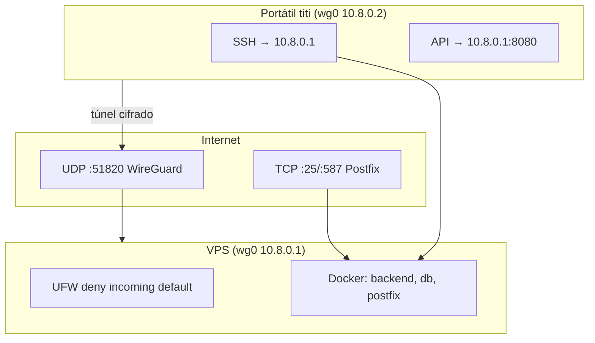

# INFRA-002 — WireGuard + firewall

> **Objetivo:** acesso administrativo e APIs internas só através de túnel VPN;
> na Internet pública ficam abertas **apenas** portas UDP do WireGuard e SMTP (25/587).

> 💡 **Conceito:** WireGuard é um protocolo VPN moderno (camada 3, UDP). Cada peer
> tem um par de chaves; o servidor atribui IPs numa rede privada (ex. `10.8.0.0/24`).

## Arquitectura de rede



> ⚠️ **Segurança:** FIN-003 (Open Banking mTLS) e painel admin **não** devem estar
> expostos em `0.0.0.0` sem VPN. O `docker-compose.prod.yml` publica a API só em
> `127.0.0.1` / interface `wg0`.

## 1. Instalar WireGuard no servidor

```bash
cd /opt/aegispass/infra/scripts
sudo ./02-wireguard-server.sh
```

Gera:

- `/etc/wireguard/wg0.conf` — interface servidor
- `/etc/wireguard/clients/titi.conf` — ficheiro para importar no portátil

## 2. Cliente (Windows / Linux / macOS)

1. Instala [WireGuard](https://www.wireguard.com/install/)
2. Importa `titi.conf`
3. Activa o túnel
4. Testa: `ping 10.8.0.1` e `ssh titi@10.8.0.1`

## 3. Firewall UFW

```bash
sudo ./03-ufw-firewall.sh \
  --wg-port 51820 \
  --allow-smtp \
  --ssh-via-wg-only
```

Com `--ssh-via-wg-only`, SSH na interface pública (`eth0`) fica bloqueado — só
acesível via `10.8.0.1` com túnel activo.

| Porta | Protocolo | Motivo |
|---|---|---|
| 51820 | UDP | Handshake WireGuard |
| 25, 587 | TCP | MAIL-002 Postfix (MX do domínio) |
| 22 | TCP | SSH **só** em `wg0` (regra UFW por interface) |

Tudo o resto: `DENY` (política por omissão).

## 4. Encaminhar tráfego Docker

O backend em produção escuta em `127.0.0.1:8080`. Para aceder via VPN:

```bash
# Exemplo: reverse proxy Caddy só em wg0 (ver production-deploy.md)
```

Ou publica `BACKEND_BIND=10.8.0.1:8080` no `.env` de produção se preferires
acesso directo sem proxy.

## 5. Próximo passo

[`production-deploy.md`](production-deploy.md) — `docker compose -f docker-compose.prod.yml up -d`
