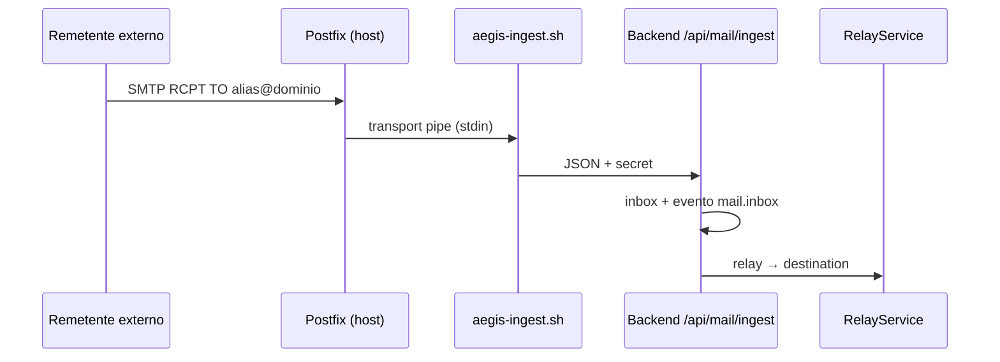

# MAIL-002/003 — E-mail em produção

> **Objetivo:** Postfix na VPS recebe SMTP para aliases `@aegis.email` (ou domínio
> próprio), o backend ingere via `POST /api/mail/ingest`, e DNS prova legitimidade
> (SPF/DKIM/DMARC).

Substitui Mailpit de dev — ver [`mail-pipeline.md`](../01-architecture/mail-pipeline.md).

## Fluxo produção



## 1. Instalar Postfix

```bash
sudo apt install postfix mailutils
# Tipo: Internet Site
# Nome do sistema: mail.seudominio.com
```

## 2. Transport pipe para o backend

Copia o script do repositório:

```bash
sudo install -m 755 /opt/aegispass/infra/postfix/aegis-ingest.sh /usr/local/bin/
sudo install -m 644 /opt/aegispass/infra/postfix/aegis-ingest.cf /etc/postfix/
```

Em `/etc/postfix/main.cf`:

```
transport_maps = hash:/etc/postfix/aegis-ingest.cf
```

Em `/etc/postfix/master.cf` (transport pipe):

```
aegis-ingest unix - n n - - pipe
  flags=R user=nobody argv=/usr/local/bin/aegis-ingest.sh ${recipient}
```

Variáveis para o pipe (systemd override ou `/etc/default/postfix`):

```
AEGIS_MAIL_WEBHOOK_SECRET=<igual ao .env>
AEGIS_INGEST_URL=http://127.0.0.1:8080/api/mail/ingest
```

```bash
sudo postmap /etc/postfix/aegis-ingest.cf
sudo systemctl reload postfix
```

O pipe envia JSON para `http://127.0.0.1:8080/api/mail/ingest?secret=...` com
`from`, `to[]`, `subject`, `body` — mesmo pipeline de ingestão que Mailpit, sem
depender da API Mailpit.

## 3. Relay de saída (MAIL-004)

No `.env` de produção:

```
AEGIS_SMTP_RELAY_HOST=127.0.0.1:25
```

O `RelayService` usa o Postfix local para entregar ao `destination` do alias.

## 4. MAIL-003 — DNS (domínio `seudominio.com`)

> 💡 **SPF** lista IPs/servidores autorizados a enviar pelo domínio.
> **DKIM** assina cada mensagem com chave privada no servidor.
> **DMARC** diz aos destinatários o que fazer se SPF/DKIM falharem.

### SPF (registo TXT em `@`)

```
v=spf1 ip4:AEGIS_VPS_IP mx -all
```

### DKIM (OpenDKIM)

```bash
sudo apt install opendkim opendkim-tools
```

Gera chave: `sudo opendkim-genkey -b 2048 -d seudominio.com -s mail`

Publica TXT em `mail._domainkey.seudominio.com` com o conteúdo de `mail.txt`.

### DMARC (TXT em `_dmarc`)

```
v=DMARC1; p=quarantine; rua=mailto:dmarc@seudominio.com; pct=100
```

Começa com `p=none` durante testes; sobe para `quarantine` / `reject` quando
estiver estável.

### MX

```
@  MX  10  mail.seudominio.com.
mail  A  AEGIS_VPS_IP
```

## 5. Verificação

```bash
# Enviar teste (de outro servidor)
swaks --to alias-teste@seudominio.com --from externo@example.com

# Logs
sudo journalctl -u postfix -f
curl -s -H "Cookie: ..." http://127.0.0.1:8080/api/mail/inbox
```

## 6. Anti open-relay

O Postfix **só** aceita RCPT para domínios configurados (`virtual_alias_domains`).
O backend valida alias na BD (MAIL-005). Nunca uses `mynetworks = 0.0.0.0/0`.
